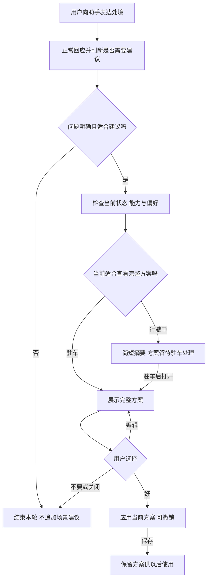
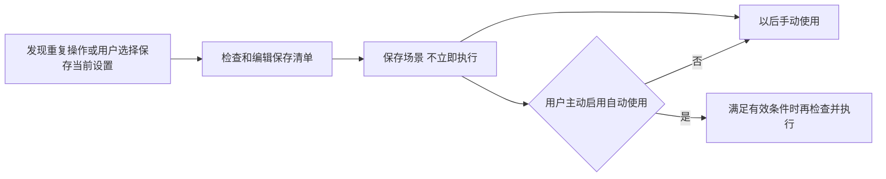

# 场景编排与主动建议产品需求

用户可以把一组车内设置保存成场景，以后一起使用。本项目让这件事更容易完成：用户可以用一句话创建场景，也可以把刚调好的设置直接保存；当用户向助手说出当前的处境，或者车内出现重复的操作习惯时，助手还可以提出建议，由用户决定是否使用或保存。

本期要验证的是：这些帮助能否减少用户选择设备、组织指令和重复操作的负担。生成了多少方案、组合了多少动作，不能单独说明功能有用。

## 1 用户为什么需要它

有些时候，用户知道要做什么，只是不想逐项配置。例如，他希望工作日早晨上车后使用一套固定的温度和座椅设置。此时，一句话创建和保存现有设置都能减少配置工作。

另一些时候，用户只说出了问题，还没想好怎样调整。例如，“窗外施工，灰都飘进来了”说明灰尘正在影响乘坐体验。助手可以结合当前车窗、内外循环和净化状态，提出一套具体的调整建议。用户不必先想清楚该操作哪些设备，但仍然可以查看、修改和拒绝方案。

主动建议的价值取决于建议是否贴合当前需要。同样是“她还要二十分钟”，有人想休息，有人想继续听节目，也有人希望保持现状。系统需要使用当前状态和用户已允许使用的偏好，不能把等待直接理解成“要开按摩、放播客”。

## 2 用户从哪里开始

本期交互覆盖以下四种方式。前两种来自用户对助手的表达；后两种来自车控操作。乘员之间的交谈不作为本期自动触发建议的输入。

| 方式 | 用户在做什么 | 系统提供什么帮助 |
| --- | --- | --- |
| 一句话创建 | 明确要求创建或修改一套场景 | 整理触发条件与动作，供用户检查、编辑和保存 |
| 处境建议 | 向助手说出当前处境或感受，没有指定完整的操作方案 | 判断是否值得建议，再展示需要用户确认的具体方案 |
| 观察建议 | 在相似情况下反复进行一组操作 | 提议把这些操作保存成习惯，减少下次重复配置 |
| 保存当前设置 | 已经把车内调到满意状态，主动选择“记住现在这样” | 列出可保存的设置，由用户裁剪、命名并保存 |

“打开空调”“把音量调到 30%”等明确车控指令仍由既有车控功能处理。“进入露营模式”等点名已有功能的请求，进入该功能，不应因此另建一个同名场景。

当前 Demo 也包含心情不好、纪念日等建议示例。它们可以进入待确认方案流程，仍需遵守拒绝、打扰和驾驶状态限制。这些案例是否适合长期主动提供帮助，需要通过体验测试判断，不能因为演示里能生成方案，就认为用户一定需要。

## 3 用户实际会经历什么

### 3.1 用一句话创建场景

用户说或输入“做一个等人时用的安静场景”。助手先说明自己理解的需求，再列出方案名称、适用条件和动作。涉及偏好的地方说明用了哪条偏好；做不了的内容说明原因，不用其他动作悄悄替代。

用户可以检查方案，也可以继续说“别放音乐”或直接编辑某项设置。修改应围绕用户这次提出的内容展开：用户只改灯光，就保留其他设置；用户明确要求同时修改温度和音量，则可以一起修改，不能机械限制为每句话只能改一项。

缺少必要信息时，助手提出具体问题。例如，无法确定用户指的是哪个座位，就先问清对象。信息仍不足时保留输入，不能展示一张没有有效内容的方案卡片。

生成方案本身不会执行车辆动作。用户检查后再选择保存，或者在支持本次应用的方案弹窗中确认使用。

### 3.2 说出处境后收到建议

以车辆停好、车窗开着、当前使用外循环且净化未开启为例。用户向助手说：“窗外施工，灰都飘进来了。”

助手正常回应这句话，同时判断车内是否有可以改善的问题。如果车辆具备相应能力、当前状态允许操作，且未触发冷却或打扰限制，助手展示方案：关闭开着的车窗，切换内循环，开启净化。已经处于目标状态的设备不应重复调整。

用户看完方案后有几种选择：说“好”或点击“好”，应用当前看到的方案；选择“编辑”，先调整方案；选择“不要”或关闭，结束这次建议。应用之后可以撤销，也可以把方案保存下来供以后使用。保存后留在当前界面，用户可以自行进入场景应用管理。

这张图说明用户经历的过程，不规定后台服务必须串行运行。建议准备不能拖住正常答话；需要播报建议时，不与导航、来电或正在进行的回复抢着说话。

行驶中不要求驾驶员查看和编辑完整方案。当前采用简短摘要、驻车后再处理的方式；“车速为零”是否足以进入完整交互，需要使用整车确认的驻车状态定义，不能仅凭临时停车放开。

### 3.3 把刚调好的设置保存下来

用户调好车窗、风量和音量后，可以长按相关控件约 1 秒，选择“记住现在这样”。菜单和车控面板底部也提供入口，避免只能靠发现长按手势使用功能。

保存清单默认勾选当前档案最近 10 分钟内手动提交、且仍不同于默认值的设置。拖动滑杆经过的中间值不算一次设置；已经恢复默认的项目不进入清单。更早调整过的设置可以展开查看，默认不勾选。

用户至少保留一项，可以删除临时操作、修改名称和单项值。保存只保留这套设置，不再次执行。没有网络时仍可保存，AI 命名是可选帮助。行驶中先保留到“场景建议”作为草稿，驻车后再整理。

例如，用户临时开过除雾，但希望以后只保留窗缝、风量和音量，就应能在保存前去掉除雾。系统不能把最近做过的所有操作都当成长期习惯。

### 3.4 把重复操作保存成习惯

观察建议解决的是“以后还想这样用”。例如，用户在相似情况下反复使用一组温度和座椅设置，系统可以询问是否将它们保存下来。用户可以查看建议的依据，也可以删除相关记录或停止这类建议。

当前 Demo 使用预设操作记录演示这条流程，尚未完成真实车辆上的长期习惯挖掘。预设记录通过检查后，展示完整方案供用户确认。这里的“好”表示保存习惯；因为当前设置可能已经调好了，不需要再执行一次。保存之后，用户仍可选择“现在使用”或继续编辑。

需要下次满足条件时自动使用的场景，由用户勾选或开启“自动使用”。只保存方案，不自动取得未来执行许可。没有可用触发条件的方案保留为手动使用场景，已有场景也不会因为版本升级被自动启用。

## 4 各入口需要遵守的共同规则

### 4.1 建议要有理由

系统需要分别判断：用户是否表达了需要改善的问题，当前是否适合打扰，以及方案里的动作是否有实际帮助。普通对话可以正常回应，不必每句话都转成场景。

当前处境建议仍沿用 Demo 的门槛：至少有两个动作需要变化，并涉及两个设置类别。这是正在验证的筛选规则，不能据此要求模型补出无关动作。是否应允许有价值的单动作建议，需要对照测试后再决定。

保存当前设置是用户主动发起的行为，不使用上述门槛；观察建议判断的是保存后对未来是否有用，也不能因为当前设备已经处于目标状态，就认为没有保存价值。

### 4.2 让用户知道自己确认了什么

方案应说明准备改变的设备、主要设置和必要的触发条件。用户确认的是当前这版具体方案。方案被编辑后，应以编辑后的内容继续检查和确认，不能把确认理解为对任意新增动作的授权。

当前界面中的相同按钮在不同入口有不同含义，需要按下表理解。统一按钮用词是后续交互优化事项，本文不假设界面已经修改。

| 当前操作 | 意义 | 不同时发生的事 |
| --- | --- | --- |
| 处境建议中点击“好” | 应用当前方案一次 | 不自动保存，不启用未来自动使用 |
| 观察建议中点击“好” | 保存建议的习惯 | 不重复执行当前已经调好的设置 |
| 创建或快存时选择保存 | 将方案保留到场景库 | 不立即执行车辆动作 |
| 选择“现在使用” | 手动执行已保存方案 | 不因此开启自动使用 |
| 开启“自动使用” | 允许方案按其有效条件触发 | 不授权超出该场景范围的动作 |

保存与未来授权分开，不等于所有方案都要出现五个按钮。各入口只呈现当前任务所需的操作。

### 4.3 执行后仍能接管和撤销

用户确认之后，执行服务还需要检查最新车况和能力是否允许操作。若关键条件不再满足，就停止相关执行并给出结果，不能只依赖生成方案时的状态。

执行前记录本次将修改设备的状态。用户撤销时，先取消尚未执行的延时动作，再恢复可恢复且未被人工接管的设置。例如，场景调暗灯光后，用户手动调亮，撤销时就保留手动调亮后的值。

分阶段方案在每个阶段开始前继续检查车况、能力和偏好。用户手动接管某个设备后，取消该设备余下的自动调整；其他设备是否继续，按方案自身的执行条件处理。撤销整个场景则取消全部剩余阶段。

这是各入口需要达到的一致行为。当前非语音本地演示已有按设备接管处理，语音本地执行仍有按当前值比较的恢复路径；两条路径及独立执行服务的行为还需要统一验证。不能笼统写成“任意时候都能完整回到原状”。

取消固定三秒试演的方案保持不变。确认后直接应用；只有方案本身包含的延时才等待。设备开始动作、到达目标状态和用户感受到效果，分别记录，不能合成一个“完成”。

### 4.4 不想用时能够结束

用户拒绝后，本轮建议结束，同类建议按冷却规则减少出现。关闭卡片、忽略建议、撤销本次、停止一类建议和删除偏好，分别表达不同意思，不能自动互相替代。

“这次不用”不能直接写成长期不喜欢；“撤销”只处理本次执行；“删除场景”删除保存的方案；只有明确表达“不再建议这类”时，才按对应设置停止这类建议。各入口当前冷却实现仍有差异，持续时间和计数口径统一后再作为产品定值。

新指令、来电、导航播报或驾驶状态变化发生时，旧建议需要重新判断是否仍适用。后台晚到的生成或命名结果，不能覆盖用户正在编辑的新内容。等待多久算过期、何时重新呈现，由本期联调确定，不沿用含义不清的“异常日什么都不做”。

### 4.5 使用能力和偏好时保持边界

方案只能使用有明确来源的能力、取值和条件。无法支持的条件要保留原因，不能删掉条件后把场景保存成更宽泛的规则；被限制的动作也不能作为“已完成”反馈给用户。

生成服务的能力清单与实车可执行范围分开管理。当前生成清单允许表达某项能力，并不证明目标车型已经具备接口。涉及车窗、座椅、视频等动作时，需要依据车型规则逐项定义前置条件，用户确认不能替代这些条件。

个人偏好来自用户已允许使用的档案。AI 返回的记忆建议不自行写入档案。Demo 中的座位、身份和习惯是明确设置的情境，不代表车辆已经能够识别真实乘员关系。

## 5 当前可以演示到什么程度

一句话生成已接入真实模型；方案检查、编辑、保存、应用和撤销可以在模拟车况中演示。当前线上接口报告使用 p36，不能据此把模拟执行写成已控制真实车辆。

长按保存、观察故事、分阶段应用、手动接管和自动使用开关已有前端及本地演示。观察使用预设证据；真实观察 AI 依赖独立服务。本次检查时，线上接口仍返回观察服务不可达，因此不能将整条观察流程写成线上真实 AI 已验收。

还需要接入或确认的内容包括真实车辆状态与动作接口、持续行为采集和学习、跨日打扰控制、账号与多乘员规则，以及各入口的统一执行行为。它们应有分别的负责人和验收记录，不能用“能力侧已齐”概括。

出厂守护、跨车与家庭联动、未经本次确认的更高自动化程度，作为后续项目讨论。原稿的自动关窗等守护设想不用于证明当前主动建议能力已经完成。

## 6 这轮怎样判断做得好不好

先检验用户能不能理解和控制方案，再检验建议有没有实际帮助。建议阶段的接受、拒绝和打扰，与执行阶段的成功、失败和撤销分别记录；保存意愿也单独统计。

核心体验测试采用三组对照：只正常回应、给通用建议、结合当前状态与偏好给建议。三组保留相同的一句话创建能力，调整体验顺序，避免把第一次看到新功能的新鲜感当成收益。

至少走通以下情境：

- 同一句扬尘或等待表达，在不同车况、不同偏好及无偏好时，方案为什么变化。
- 用户说“别放音乐”“不是我冷”或只修改一个设置时，系统能否保留否定、对象和未要求修改的内容。
- 方案等待期间开始行驶、出现来电或用户换了话题时，是否仍错误呈现旧建议。
- 用户手动接管、某项执行失败或撤销分阶段方案时，剩余动作和设备状态是否符合规则。
- 保存但未开启自动使用、开启后条件不满足、条件持续满足时，是否分别做到不执行、不执行、不反复触发。
- 使用一段时间后，用户是否仍愿意接受建议，以及拒绝和关闭功能的真实原因。

原有指标与时限保留在[实现状态与验证依据](实现状态与验证依据.md)，其中尚未确定口径的数字不作为已完成的验收结论。生成测试成绩只能说明该题集上的输出水平，不能代替真实用户对建议价值的评价。

## 7 评审需要形成的决定

本轮重点确认建议动作是否有依据、四种入口是否容易区分，以及应用、保存和自动使用的含义是否足够清楚。对存在实现差异的执行与撤销规则，要确定统一行为和负责团队。

仍需讨论的产品选择包括：处境建议是否继续要求两个动作且跨类别；心情、纪念日等弱线索适合出现到什么程度；各类拒绝的冷却如何统一；驾驶状态、播报等待和过期丢弃使用什么可信条件；合并已有场景时如何保留新增动作的适用范围。

这些问题会影响用户实际经历的流程。确认后再冻结相应规则，并同步更新 Demo、正文、流程图和验收记录。

相关材料：[线上 Demo](https://hadan.blog/demo0908) · [修改说明与原图处理](修改说明与原图处理.md) · [实现状态与验证依据](实现状态与验证依据.md)
