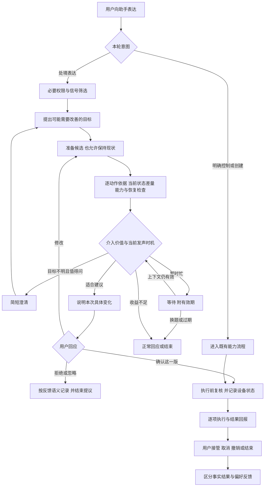
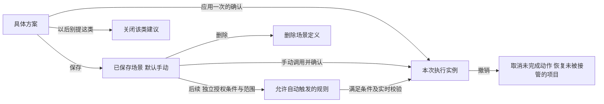

# 场景编排主动智能与八张流程图评审

评审日期 2026 年 9 月 8 日

评审对象为本次上传的精简版 PRD 正文、表格及八张业务和技术流程图。按最新要求，当前 `scene-runtime-integration` Demo 的产品交互优先于 PRD；基线为提交 `0ad7561`，本次最终交付只修改文档，Demo 保持原样。本文支持探索性立项。未提供的配套定义不视为不存在；本文不把 Demo 的模拟能力视为整车能力已经交付。环境没有可用浏览器，本轮通过界面代码、案例、控制器和接入说明核对，未完成在线点击体验。

**阅读方式：**第 3—5 节为评审意见与待讨论方案，不是对当前 Demo 已实现行为的描述。与 Demo 同步的 PRD 正文及修改清单分别见同目录修订稿和《PRD修改说明》。

## 1 总体判断

**方向合理，而且有直接相关的车载研究支持；目前的图更像功能和模块的连接图，尚未完整表达主动服务如何作出产品决策。**

原方案值得保留的是：处境表达不必等用户组织成控制命令、主动层复用生成与执行基础、建议与已保存场景分开、尝试处理拒绝和恢复。这些构成了可探索的产品起点。

最需要改进的不是多加一层模型，而是补上三种判断：用户可能需要改善什么；这个方案比保持现状好在哪里；此时提出它是否值得。随后必须把“理解了需求”和“取得了执行授权”分开。

本期更准确的定位是**对话内的主动帮助**：用户已经向助手说话，助手主动发现其中可能存在的帮助机会。这仍具有主动性，只是没有承诺环境持续监听、自主发起陌生话题或无确认执行。三类能力可以独立迭代，不必先具备长期记忆才能开始验证价值。

读完论文后，我也会修正一种过度保守的理解：不能要求用户已经把需求说得和车控指令一样清楚，才允许建议。可以依据处境和可靠偏好推测需求，关键是推测有证据、建议可理解、用户保留控制权。当前 Demo 保留等待、长途等案例；本文不将它们擅自删除或改成只回应。无偏好等待时是否仍应提供通用方案，应通过对照验证。

Demo 也改变了我对授权文案的判断：驻车时已经直接展示完整动作卡片，用户说“好”可以是在确认可见的具体方案，不能单凭旧 PRD 的“要布置一下吗”就认定这个界面没有告知。需要补充的是卡片、语音与方案版本之间的关系；如果未来只保留语音，就需要在语音中说清主要变化。当前行驶建议留待停车处理，不应按尚未实现的行驶即时确认流程评价它。

## 2 论文证据及适用边界

检索优先使用 ACM、ACL Anthology、IJCAI 官方论文集及作者或机构原文；覆盖至 2026 年 9 月 8 日能核验的资料。以下将顶会论文、经典高引用工作、综述和最新预印本分开。没有将“最新”自动等同于“证据最强”，也没有将预印本写成已录用顶会论文。

| 论文与来源 | 可核验的研究内容 | 对本 PRD 的启示及边界 |
| --- | --- | --- |
| Susak 等，**ProVoice**，CHI 2026。[正式 DOI](https://doi.org/10.1145/3772318.3791877)，[作者全文](https://arxiv.org/html/2601.19421v1) | 19 人 VR 驾驶研究，围绕停车改道任务，用多目标贝叶斯优化探索自主程度及声光提示，衡量心理负荷、可预测性和有用性。 | 应同时优化价值、负荷和可预测性；不能只追求采纳。部分参与者认为要求立即确认也会分散注意；偏好的自主程度依任务而变。小样本、单一任务和主观指标不能证明某种交互已具备道路安全性。 |
| Du 等，**Towards Proactive Interactions for In-Vehicle Conversational Assistants Utilizing Large Language Models**，IJCAI 2024 人本 AI 专题。[官方全文](https://www.ijcai.org/proceedings/2024/0869.pdf) | 区分需求推断与系统自主性；40 人在静止车辆配动态环幕的实验中比较五种策略。论文所称 Level 4 保留执行前确认，综合评价较好。 | 直接支持“结合更多上下文提出个性化建议，再由用户确认”的方向。论文 L4 与本 PRD L4 含义不同，不可套用编号。其对话任务成功率不是车控可靠率，也不是量产驾驶场景的用户收益。 |
| Yoon 等，**Beyond Task-Oriented and Chitchat Dialogues: Proactive and Transition-Aware Conversational Agents**，EMNLP 2025 主会。[论文及全文](https://aclanthology.org/2025.emnlp-main.672/) | TACT 数据集覆盖闲聊与任务对话间的双向切换，提出 Switch 和 Recovery 指标。 | 图 2、图 3 不能只画“闲聊转场景”，还要画用户拒绝后的话题恢复，以及新指令抢占。该论文验证的是对话建模，不能直接支持车内打扰额度或安全阈值。 |
| Oh 等，**Better to Ask than Assume**，CHI 2024。[机构记录及 DOI](https://pure.kaist.ac.kr/en/publications/beter-to-ask-than-assume-proactive-voice-assistants-communication/) | 在可控制设备的智能家居环境中采用 Wizard of Oz 方法，研究尊重用户自主权的主动语音沟通。 | 可以借鉴动态表达、纠正和协商设计。本文核对了机构摘要和会议元数据，没有据此虚构样本量；家居交互结论仍需在驾驶负荷下验证。 |
| Semmens 等，**Is Now A Good Time? An Empirical Study of Vehicle-Driver Communication Timing**，CHI 2019。[正式论文](https://doi.org/10.1145/3290605.3300867) | 63 位驾驶者在约 50 分钟驾驶中提供 2,734 次可打扰性反馈；结合车辆和视频数据分析时机。 | 比固定冷却或仅看车速更相关的是驾驶任务和环境。支持把“是否有价值”和“现在是否合适”分开；研究对象为接收非驾驶信息，不等于证明复杂车控方案在同样时机都合适。 |
| Amershi 等，**Guidelines for Human-AI Interaction**，CHI 2019，经典高引用工作。[作者全文](https://www.microsoft.com/en-us/research/wp-content/uploads/2019/01/Guidelines-for-Human-AI-Interaction-camera-ready.pdf)，[正式 DOI](https://doi.org/10.1145/3290605.3300233) | 提出 18 条交互指南，并由 49 位设计实践者在 20 个 AI 产品上检验。 | 图 6、图 7 应落实情境相关、容易拒绝和纠正、不确定时收窄服务、谨慎适应和全局控制。它提供设计依据，不提供“拒绝三次”或“十四天”的车载参数。 |
| Horvitz，**Principles of Mixed-Initiative User Interfaces**，CHI 1999，经典基础工作。[作者全文](https://erichorvitz.com/chi99horvitz.pdf) | 将目标不确定性、收益、错误代价和用户交互结合，讨论何时执行、询问或等待。 | 图 5 的“值得吗”应与不介入相比较；模型相关度不是完整的介入价值。这里借用决策思想，不要求首期实现概率模型或完整 POMDP。 |
| Bérubé 等，**Proactive behavior in voice assistants A systematic review and conceptual model**，Computers in Human Behavior Reports，2024。[原文](https://cocoa.ethz.ch/downloads/2024/05/2823_Berube%20et%20al.%202024%20-%20Proactive%20Voice%20Assistants.pdf) | 系统综述纳入 21 项用户研究，以情境、发起、行动组织主动行为；非紧急场景结果较混合。 | 支持逐场景验证价值，不支持“一切舒适场景都应主动”。这是一篇同行评审期刊综述，并非顶会论文；综述检索范围也不代表截至今日全部研究。 |
| Tang 等，**Proactive Service Agents A Unified Decision Framework Methods and Evaluation**，2026 年 9 月 3 日预印本。[arXiv 记录](https://arxiv.org/abs/2609.03727) | 摘要将沉默、询问、帮助、行动，以及授权、介入成本和反馈纳入统一决策框架。 | 可作为最新概念追踪，提示不要只评测触发分类。本文仅核对摘要与提交记录；未核验顶会录用，也不以它作为用户效果或阈值依据。 |

这些证据并不完全指向一种固定自主程度。IJCAI 的结果支持保留确认；ProVoice 同时暴露了确认带来的负荷，以及不同情境下的自主偏好。**我的产品判断是：首期保留具体确认，同时允许系统选择暂缓或不介入；未来自动执行应由场景授权解决，不能靠用户来不及否决来取得权限。**

## 3 八张原图逐张评价

图号按附件中的出现顺序标记，便于与 Word 对照；不是论文中的图号。

### 图 1 整体业务架构

**判断：总体分层可保留，入口和执行权限必须修改。** 四种入口共同复用场景能力有工程价值，但它们的授权含义不同：显式创建授权生成提案，长按保存授权保留配置，处境表达只提供推断线索，观察学习只形成候选。

“长按保存 → 引擎”的箭头会被理解为保存即执行，应改为“配置快照 → 用户核对 → 场景库”。已保存场景到引擎之间，补充“用户手动调用／独立的自动触发授权”。显式创建可以绕过主动打扰额度，不能绕过能力、驾驶状态和执行校验。观察与长按用虚线标为后续阶段，出厂守护从本期总图移出。

### 图 2 语音域路由与编排

**判断：技术链条基本合理，缺少话轮和控制归属。** NLU、领域助手、场景生成、校验器的职责可以保留；不必因前沿论文使用某种 Agent 就重做现有平台。

增加三个可追踪对象：本轮用户意图、当前候选方案版本、当前发言权。闲聊代理可以提出潜在帮助机会，场景代理返回候选，但由统一会话协调决定说不说、何时说。不要让两个代理分别播报。车辆信号需带来源、采样时间和未知值；记忆需要适用人和适用情境，不应只画成一条无条件输入箭头。

否定、对象变化和新指令必须能回到路由层并使旧提案失效。例如“不是我冷，是后排冷”应重新确定对象，而不是沿用主驾调温方案。参考 TACT 的切换与恢复视角，但不直接采用其指标数值作为本项目目标。

### 图 3 D1 闲聊之后建议的时序

**判断：回应优先有道理，把理解工作强制串行延后则没有充分依据。** B 方案画成“闲聊回答完 → 最近两轮和记忆 → 再判断并生成 → 再播建议”，容易让助手已经自然结束话题，又突然补一句；也让总体延时长于标注的三秒。

建议从用户话轮结束起，并行进行自然回应与受限候选准备，**发声仍串行仲裁**。候选及时就绪可合成一次“回应＋具体建议”；未及时就绪，仅在话题仍相关且允许打扰时补充。用户换题、来电、导航播报或车况变化时，取消或重新计算，不能播出过时建议。

“只调用一次大模型”应写明是只计算场景子流程，还是包含闲聊回答的端到端次数。A／B 应用延时、连贯性、重复表达和介入价值做对照，不应仅凭调用次数选型。无需为采用论文中的 Rewrite／ReAct／Reflect 而强制增加三个独立调用。

### 图 4 观察学习支路

**判断：可作为后续路线，本期不宜与处境建议共同承诺成熟。** 频繁操作、短期显著性和七天影子运行，只能说明模式出现，不能直接说明用户希望它自动化。

补上“机会次数”作为分母：三次晚间到家都开座椅加热，与三十次中三次的意义不同。排除场景自己执行产生的事件、误触、临时访客、设备异常以及用户纠错动作，防止系统把自己造成的行为学回去。

先形成带适用范围的候选，用户核对后保存；不能从挖掘结果直接通向执行。对工作日晚十点后的习惯保留局部条件，无法表达时另建更具体场景。七天、重复次数和显著性阈值都列为待验证假设。

### 图 5 能做 适合 值得的门控

**判断：意图正确，是本次最值得重画的一张。** 它试图限制无价值和不合时宜的出手，但在尚无具体候选方案前判定“值得”，缺少必要信息；“车辆改变不了拥堵”也不是恰当的判定对象。

改为两阶段。生成前做廉价筛选：是否向助手表达、开关是否允许、有没有帮助线索、必要信号是否可用。生成后再检查每个动作的依据、相对当前状态的增量、能力和恢复条件、解释负担，最后决定现在说、稍后说、澄清还是正常回应。

“保持现状”应是合法候选；有用的单动作不因不够两个元素而被淘汰。拒绝节点也应分开：明确禁用、暂时忙、候选过期、目标不明和校验失败，不应统一记成用户不喜欢。

### 图 6 L0 到 L4 信任升级

**判断：不建议保留为统一升级轴。** 图中静默学习、语音询问、弹卡、默认执行前允许否决、静默执行，分别属于学习、呈现和授权。卡片与语音没有天然的等级高低；用户常点“好”也不代表已经授权未来无确认执行。

替换为四个独立配置：是否积累偏好、是否允许主动建议及其额度、依场景和驾驶负荷选择呈现方式、某条场景是否取得自动触发授权。信任作为研究观察指标，不作为越过授权的凭据。不同论文的 Level 编号不互通，不能把文献中的 L4 推荐写成支持此图的静默执行。

### 图 7 场景生命周期

**判断：生命周期意识值得保留，当前把三个对象混成了一个。** 应拆为候选提案、已保存定义、本次执行实例；此外偏好是第四类独立数据。

删除“撤销／删除 → 负面记忆墓地”的直接箭头。撤销是恢复本次设备变化；删除场景可能是清理过期内容；只有“以后不要再建议这个”等明确表达，才进入相应类型的禁用记录。对拒绝本次仅做短期冷却，对忽略仅保留不确定反馈。

把首次三秒试演替换为“具体提案 → 确认 → 本次应用”。执行结束和撤销都要先看设备是否已被人工接管；“谢幕回原状”不能覆盖用户刚刚调亮的灯。

### 图 8 生成与执行技术闭环

**判断：保留约束生成和确定性校验，但要补产品契约和运行时反馈。** 受限解码有助于约束输出格式与能力词表，不能证明需求理解正确，也不能创造执行权限。模型自我反思同样不能替代校验器。

候选携带意图、来源事实、动作依据和上下文版本；用户确认绑定具体方案版本与设备范围；执行前复核实时车况并记录设备状态；设备逐项返回结果，支持部分失败、取消和人工接管后的选择性恢复。不要把命令受理等同于物理效果完成。

八道注入题等发布测试移到离线评测支路，在线保留可执行的权限、输入与约束检查。300 token 记忆、Top 3 召回、小模型单次生成、300／500 毫秒，都属于可验证的工程选项，不是产品逻辑本身。用户解释展示可核验依据，如“后排正在休息，所以建议把声音留在前排”，无须展示模型内部推理过程。

## 4 后续可讨论的目标架构图

以下为基于研究的建议架构，不代替当前 Demo 流程，也不作为本轮代码修改要求。当前 Demo 对齐图见 PRD 修订稿。

图中显式创建仍须先展示提案并取得应用确认；它进入既有能力流程，不表示可以从“创建”直接执行。保存与自动触发单独表示如下。

## 5 产品验证应回答的问题

不要只验证能否把话转换成 JSON 或生成漂亮卡片。建议预先注册三个条件：正常回应、通用建议、结合状态和授权偏好的建议；三组显式创建能力保持一致，平衡体验顺序，避免主持人诱导。

按“用户 × 场景 × 重复使用”观察：建议是否指出真实需要、每项动作是否有帮助、时机是否合适、确认后是否主动改回、下一次是否仍愿意使用。只测试扬尘这样的强案例，会高估泛化能力；只测试含糊抱怨，又会低估可用价值。

对单动作和组合动作分别评测。组合需要证明相互配合有增量收益，不能因为“场景编排”这一名称而凑动作。对等待场景，至少区分明确休息意图、有等待偏好、只有一般偏好、完全无偏好；目前 Demo 的简单偏好匹配不足以证明情境适配已经成立。

驾驶实验在模拟器或受控环境进行，同时观察任务表现和主观负荷。先验证语音建议的长度与时机，不把“可以不看屏幕”当作“没有认知负担”。长期研究再观察偏好漂移、拒绝原因和主动服务关闭情况。

## 6 优先修改与后续讨论

建议优先讨论图 5 的决策对象、图 6 的授权轴、图 7 的反馈语义，以及图 1／8 的执行边界。图 2／3 的会话协调与过期取消作为待设计事项，图 4 保留为后续探索。本轮实际修改限于 PRD 对齐与问题标注，不据此变更 Demo。

后续最值得讨论的是：对于用户只说“她还要二十分钟”，你期待系统提供怎样的额外价值，是提供通用的舒适等待方案，还是理解其通常如何等待？当前 Demo 允许通用方案，PRD 正文保留这一行为；个性化方案是否更有价值作为实验问题，不把我的偏好或论文推论写成已经确认的产品决策。
