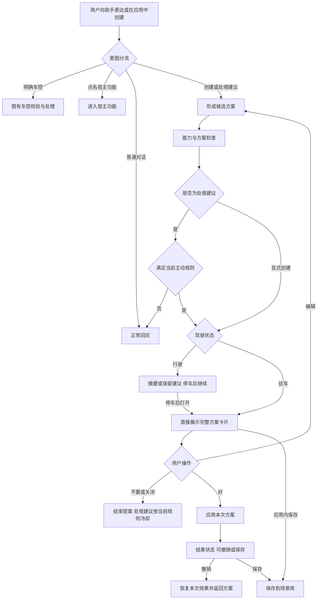
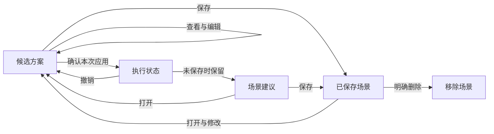

# 场景编排主动层 PRD 修订稿

版本 Demo 对齐评审稿　日期 2026 年 9 月 8 日

本文用于产品立项与方案评审，以当前 Demo 的产品交互为优先依据。基线为 `work/scene-runtime-integration` 提交 `0ad7561`，包含 v19 界面与 Part 1 Runtime 可选接入。本文是原上传 PRD 的修订稿，不修改 Demo，也不将研究建议写成已经实现的功能。

原附件为精简版，未提供的配套定义不推定为不存在。当前环境没有可用浏览器，核对方式为界面代码、案例、交互控制器与接入说明；未完成在线点击或实屏体验。正文描述当前产品方案，未确认事项集中列在第 9 节。

## 1 产品目标

一句话创建复杂场景是基础能力。主动层的核心是：用户向助手表达处境时，助手结合可用车况与偏好，提出可查看、可修改、经用户确认后应用的场景建议，减少用户自行组织多个设备操作的负担。

首期以对话内主动帮助为核心。用户不必先列出车控动作；乘员之间的交谈不作为本期触发来源。系统可以主动提出建议，但生成候选不等于立即执行。

战略上支持主动智能探索；场景价值仍需验证。竞品定位不再使用“各家均停留在单动作、无人将主动与组合接通”的绝对描述。宝马官方资料已描述组合方向盘加热、座椅加热与除霜的例程；本项目应验证自然处境表达、个性化建议和打扰控制的具体体验差异。[宝马官方资料](https://www.press.bmwgroup.com/italy/article/attachment/T0452399IT/636632)

原文中未经核验的“奔驰约八次”、Nest 因果案例不作为立项证据；相关数字与结论在取得可靠出处前删除。

## 2 产品范围与入口

| 范围 | 当前方案 |
| --- | --- |
| 场景应用 | 自然语言创建、手动创建、编辑、局部续改、保存、查重、删除和打开已保存场景 |
| 主动服务弹窗 | 接收处境表达，呈现场景建议，支持好、不要、编辑和关闭 |
| 直接车控与宿主功能 | 用户已明确动作时走车控；已有录音、露营等功能走宿主入口，不重新创建场景 |
| 普通对话 | 拥堵抱怨、情绪、关系等案例正常回应，不默认创建场景 |
| 场景建议页 | 保留建议，支持查看、编辑、保存与模板入口 |
| 偏好管理 | “它学会了什么”支持按档案增加、修改、删除、取消与恢复；数据保存在浏览器 |

保留 Demo 的场景建议、直接车控、普通对话三类示例。现有案例为 25 个创建、7 个建议和 11 个车控／对话分流案例；这是演示覆盖数，不是已证明有价值的量产场景数。

观测学习、长按保存、出厂守护、关系身份推断、跨车与家庭联动、统一运营通知体系重建不列为当前 Demo 已完成能力。原相关方案保留到后续路线和待确认项，不进入当前主流程。

## 3 核心交互

### 3.1 驻车主动建议

识别处境并形成可呈现方案后，直接展示完整方案卡片。用户表达与助手回复位于卡片外；卡片展示场景名称、条件、动作、所用偏好及必要的能力调整。

保留现有“好／不要／编辑”以及关闭按钮，不增加先询问是否查看方案的邀请页。用户可以先看清动作再决定；“好”对应当前可见方案的本次应用。若编辑，则继续在同一方案内修改。

确认后进入应用状态，提供撤销和保存。取消固定三秒试演与倒计时；场景本身明确包含的延时动作仍按顺序执行。不能把技术调用耗时或设备等待解释为产品强制试演。

### 3.2 行驶状态

以 Demo 现有行为为准：处境建议保留至“场景建议”，提示停车后查看；完整方案的查看、编辑和后续操作留待停车。能够展示的行驶方案使用三行摘要：名称、动作概要、停车后继续。

本稿不新增“行驶中播报具体组合后立即确认执行”的流程。明确设备指令继续由既有车控规则承接，受到当前能力和行驶约束限制。产品覆盖行驶状态，不意味着驻车完整卡片在行驶中开放。

Demo 当前只有停车／行驶二态开关。临时停车、真实驻车判定和高负荷信号如何从整车获取，见待确认项；不写成已接入。

### 3.3 创建与续改

用户在场景应用中明确创建时进入场景生成，信息不足可补充后继续。用户也可以手动选条件和动作。局部续改保留不相关动作；复杂批量修改按现有编辑能力处理，不承诺任意自然语言修改均可靠。

“打开录音模式”“进入露营模式”走已有宿主功能入口；“创建露营场景”才进入编排。前者不等于该宿主模式已经成为可由编排调用的已交付原子能力。

### 3.4 保存 建议与应用

生成、应用、保存是三个不同事件。生成产生候选；“好”应用本次；保存将方案保留到场景库。保存本身不立即改变车辆状态。已应用但尚未保存的方案可保留在场景建议中。

当前产品界面没有独立的“启用自动触发”授权流程，本稿不描述保存后已取得未来自动执行许可。可选技术服务的保存与调度语义仍需核对，不能仅凭界面“保存不立即执行”推导后台没有可触发规则，详见第 9 节。

## 4 当前主动案例

以下保留 Demo 的输入及方案思路，不因本次论文调研而删除或替换案例。具体值仍受档案、校验和运行模式影响。

| 案例 | Demo 当前方案 | 评审关注点 |
| --- | --- | --- |
| 她说还要二十分钟 | 灯光、音量、温度等等待方案；有偏好时可调整，无偏好时有默认方案 | 通用等待方案能否提供价值，需与正常回应、个性化方案对照；不在正文改成无偏好就不建议 |
| 后排已经睡着了 | 前排声场、降低音量、调暗氛围灯 | 保留现有组合；分别验证声音和灯光变化是否符合需要 |
| 离开会还有半小时 | 主驾声场、低音量、屏幕亮度 | 验证会前准备目标及屏幕亮度变化的实际帮助 |
| 窗外施工 灰飘进来 | 关窗、内循环、空气净化；独立示例初始主驾窗有开度 | 较明确的因果组合；自由输入时仍需注意当前车窗和空气状态 |
| 晒了一下午 座椅烫 | 遮阳、座椅通风、温度调整 | 验证每项动作依据与目标车型可调用性 |
| 这趟路还挺长 | 空气净化、低音量、出风模式 | 保留探索案例；不把长途感叹直接视为已证明需要这三个动作 |
| 英文等待表达 | 与中文等待相同的主动建议思路 | 验证跨语言表达和能力字段的一致性 |

“刚停下来有点累”在当前分流案例中先回应休息，需要宿主休憩模式时可明确点名。普通拥堵抱怨不主动布景；正文将理由写成“目前没有明确的座舱改善目标”，避免以“车辆不能消除拥堵”错误推导该类处境永远无法服务。

## 5 主动判断与打扰规则

当前演示门控检查安静模式、高负荷、同类拒绝冷却、相关负面偏好、询问额度和候选可保存状态。对一般场景，现有规则要求至少两个动作发生变化，且跨两个设置类别；休憩分支存在单独处理。这是当前 Demo 规则，不能写成由论文证明的通用价值准则。

同类拒绝当前设置为七天冷却时间戳，但账本保存在内存，未形成跨日持久化服务；点击独立示例会重置对应演示情境和账本。不要将其描述为已经实现真实车辆七天持续免打扰。

当前一次演示的询问额度为一次。关闭卡片与“不要”均进入拒绝处理；长期“以后别提这类”与忽略尚未形成独立语义。本文同步描述现状，不把短期冷却、永久关闭和恢复的新交互写成已实现。

显式创建不受主动建议的打扰额度约束，但仍需能力校验。示例模式与真实 AI 模式的生成链路不同，不以示例的确定性或响应速度代表真实模型表现。

“是否能帮到用户”的产品解释应围绕可改善目标；是否删除“两类变化”门槛、是否逐项剔除无必要动作，由后续验证决定。本轮保留 Demo 实际行为。

## 6 当前主流程图

此图表达产品流程，不强制各运行模式相同的内部调用顺序。显式创建绕过主动额度；真实 AI 行驶分支与示例门控顺序有实现差异，技术时序以对应模式为准，不将它们画成一条已经统一的调用链。

删除场景、撤销执行和移除偏好不画成同一条负面记忆箭头。当前 Demo 没有原 PRD 的完整自动信任升级和负面记忆墓地；原生命周期图中的相关部分移至待讨论设计。

## 7 生成 执行与恢复边界

生成候选不直接改变设备。模型返回 action 标签也不能使明确的“创建场景”请求绕过用户确认；直接车控的处理依据用户表达和既有分流。

当前生成有两种接入路径。未配置 Part 1 Runtime 时使用已有 p13 路径；配置并由模型目录确认接入后，真实生成与确认进入独立技术服务。技术服务失败不静默回退为示例或 p13。公共站点不能因本地源码已接入就被描述为已上线完整技术结构。

本地模拟执行保存执行前设备值；撤销时，对当前值仍等于本次执行值的项目作恢复。这个机制不能证明物理按键接管、多次改回相同值或跨场景冲突已经完整解决。技术服务模式由后端处理快照、延时段检查、取消和恢复，并显示返回的失败。

延时动作按顺序执行，后续指令可停止待执行段。方案中的规划和提议能力可以作为概念展示，不能认定为已执行。命令受理、模拟状态变化和真实设备效果达到是不同状态，本稿不承诺“500 毫秒内全部完成”。

产品交互以 v19 无强制三秒试演为准。参考技术服务源码仍可见非 action 意图的三秒分段策略，该路径与产品约定的一致性列为接入核对项；本轮不修改服务或 Demo，也不隐瞒此差异。

## 8 偏好与已保存场景

“它学会了什么”当前是可编辑的档案偏好管理；支持增加、修改、删除和恢复，不代表已部署连续行为观察学习。AI 返回的记忆建议不会自行写入档案。偏好和场景保存在当前浏览器，未接入账户跨端同步。

当前已有相似场景检索、差异提示和更新／另存流程。相似性使用条件关系和动作重合进行判断；不能将技术相似直接等同于语义上允许合并。具体的局部条件保留和复杂时序合并问题列在第 9 节，不擅自改变 Demo 的查重行为。

原“前十四天静默学习”和“第四晚开始提示”不再出现在当前交付主线；后续若建设观察学习，应独立定义样本机会数、触发范围、排除系统自身执行及用户纠错事件的规则。

## 9 待讨论与验证项

本节是评审建议，不作为本轮已确定的 Demo 变更要求。优先级指讨论顺序。

| 编号 | 问题 | 建议方向 | 本轮处理 |
| --- | --- | --- | --- |
| D01 高 | 至少两个动作且跨类别是否会鼓励凑动作 | 比较单个必要动作与组合的收益；逐项校验必要性 | 保留 Demo 规则，标为设计假设 |
| D02 高 | 等待、长途的通用组合是否有真实价值 | 正常回应／通用建议／个性化建议对照 | 保留案例，不自动降级为不建议 |
| D03 高 | 保存与后端可触发规则的关系 | 明确应用一次、保存、自动触发的独立权限 | 只确认保存不立即执行，不宣称已隔离后台自动触发 |
| D04 高 | 撤销如何处理人工接管与部分失败 | 按设备记录控制归属，恢复未被接管且可恢复的项目 | 说明现有值比较与后端快照边界，不承诺全通道恢复 |
| D05 高 | 合并可能改变新增动作的适用范围 | 新增动作保留自身条件，不能表达时另存 | 保留现有查重界面，记录语义验证要求 |
| D06 中 | 拒绝、关闭、忽略、永久禁用尚未分开 | 将本次反馈和长期偏好区分 | 现状写明，不新增按钮或改冷却时长 |
| D07 中 | 驻车、临时停车和驾驶负荷定义不足 | 由整车可信信号提供状态与可交互条件 | 保留二态演示，不开放行驶即时组合确认 |
| D08 中 | 闲聊回答、候选生成及播报的时序 | 评估并行准备、串行发声、换题取消与过期丢弃 | 不写死新增 3 秒 SLA、10 秒等待或 30 秒有效期 |
| D09 中 | 后端仍可能有三秒分段策略 | 对照启用技术服务后的实际调用与产品约定 | 标为接入差异，本轮不改服务 |
| D10 中 | 安全分级与出厂关窗守护冲突 | 出厂功能另归整车规则，具体动作逐项定义前置条件 | 从当前主动层主流程移出，不代替整车团队制定许可 |

安全带、近光灯可以是条件信号，但不能直接等同于乘员身份、儿童或真实天黑。用户确认也不能替代动作前置条件。上述为产品定义应澄清的事项，不推定配套平台完全没有规则。

## 10 验证指标与定稿要求

分别记录本次应用、保存和未来自动授权，不将“好”与“存”合计为一个采纳指标。建议阶段观察目标和动作是否合适、打扰与主动服务关闭；执行阶段观察完成、修改、撤销及恢复。删除场景的原因需要区分学错、过期、隐私顾虑和整理。

三组对照保持显式创建能力一致：仅正常回应、通用方案建议、结合状态与偏好的建议。对同一句话改变车况、偏好和否定信息，并观察重复使用后的接受情况；驾驶验证在模拟器或受控环境开展。支持更多上下文推断的论文不等于证明全部默认组合均有帮助。

原 40%、0.7、十四天等阈值在没有依据时标为假设；八道注入题为回归集的一部分，不以通过这组测试推出全面可靠。真实模型时延和质量用专门实验说明，不引用示例模式的确定性结果作为证据。

方案定稿前，需要核心案例解释每个动作的必要性，确认保存及恢复语义，具名首期依赖负责人，并验证用户是在接受真实帮助而非配合演示。当前已有可复用基础，仍未接入真实车辆、连续观测学习、跨日额度、真实播报仲裁或账号同步；不写成能力侧全部齐备。

## 11 八张原图的处理

| 原图 | 本轮 PRD 修改 |
| --- | --- |
| 1 整体架构 | 当前主线只展示 Demo 对应入口，观察、长按、守护另放后续路线；不把保存直接连到执行 |
| 2 语音路由 | 与场景建议、直接车控、宿主功能和普通对话分流一致；待接入模块明确标识 |
| 3 D1 时序 | 删除强制邀请页／试演链，改为完整方案可见后确认；调用次数和播报时机不写成已验证保证 |
| 4 观察学习 | 移至后续能力，不把偏好编辑页描述为持续观察学习已实现 |
| 5 门控 | 如实写当前规则，同时标注多动作门槛与价值判断的待验证问题 |
| 6 信任升级 | 不作为当前交付状态机；学习、打扰与自主执行如何拆分见研究评审 |
| 7 生命周期 | 使用候选、建议、保存和本次执行的实际流转；不把撤销／删除连到长期负面记忆 |
| 8 技术闭环 | 区分 p13 与可选 Runtime，标明校验、确认和模拟执行；离线评测不画成已接入的在线组件 |

论文证据、逐图详细判断及后续架构建议见《主动智能与八张流程图评审》；逐项修改原因见《PRD修改说明》。两份说明均不会改变本稿中 Demo 优先的基线。
