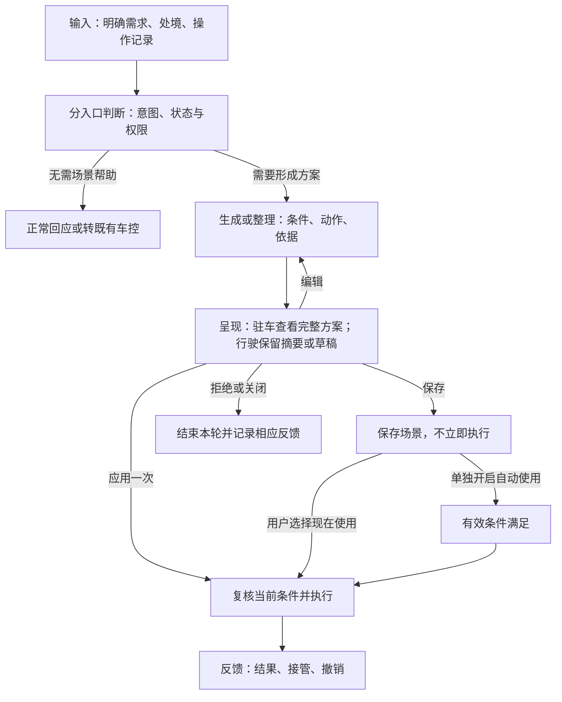

# 场景编排与主动建议产品需求

## 1. 产品概述

### 1.1 产品背景

用户调整车内环境时，常遇到两类麻烦：知道想要什么，却要逐项配置；说得出困扰，却不知道该调哪些设备。例如，“灰都飘进来了”，还需要自己想到关窗、切换内循环和开启净化。

现有车控和编排能力已能执行、组合动作。**本产品帮助用户形成合适的设置方案，并把愿意重复使用的设置保存下来。** 支持一句话创建、处境建议、观察建议和保存当前设置四种方式。

本期重点验证：**建议是否贴合需要，能否减少自行判断和重复操作的负担。** 交互以 Demo 为准，实车执行和长期学习仍需验证。

### 1.2 产品价值及体验目标

#### 1.2.1 看行业

车内助手已有组合例程和习惯建议，详见 1.4。我们的切入点是：用户未列出完整动作时，结合处境、当前设置和已授权偏好，**判断是否值得建议、具体建议什么**。

#### 1.2.2 看用户

主要服务于希望少配置、少重复操作，同时保留控制权的用户。

- **说得清目标，就能创建。** 从逐项配置变为描述需求、检查方案。
- **只说出困扰，也能得到具体帮助。** 建议说明准备调整什么，用户可以改或拒绝。
- **调得满意，就能留到下次。** 保存当前设置或重复习惯，自动使用另行开启。

操作次数和用时由相同任务的对照测试确认，目前无实测收益数据。

#### 1.2.3 看企业

- 让已有车控和编排能力更容易被发现、被持续使用。
- 复用生成、执行和场景管理能力，减少每个场景单独开发的工作。
- 在用户授权范围内积累可纠正、可删除的偏好，改善后续建议。

以上为预期价值，尚无真实用户留存或商业收益数据。

### 1.3 名词解析

| 关键词 | 定义 |
| --- | --- |
| 场景 | 可一起使用的一组设置；有有效条件且单独启用后，可自动触发。 |
| 处境建议 | 根据用户向助手表达的处境或感受，提出本次可用的调整方案。 |
| 观察建议 | 根据相似情况下的重复操作，提议保存一套习惯设置。 |
| 保存当前设置（快存） | 用户主动选择并保存已经调好的设置。 |
| 方案／草稿 | 尚在查看或编辑的内容；生成或保留草稿均不代表执行。 |
| 本次执行 | 场景的一次运行；执行记录、延时动作和撤销归属于这一次。 |
| 人工接管 | 用户通过语音、触屏或物理控件重新控制某个设备。 |

### 1.4 产品对标及产品分析

#### 1.4.1 对标分析

以下依据厂商公开资料，功能适用范围随车型、地区和版本变化。

| 产品 | 入口与交互 | 能力边界及借鉴 |
| --- | --- | --- |
| BMW Intelligent Personal Assistant／OS X | 语音助手、主动提示；用户可接受建议，创建例程。 | 官方已描述多个常用功能组合并自动启动。组合能力本身不足以构成差异化，应比较建议是否贴合当下需要。[官方说明](https://www.bmw.co.uk/en/digital-services/bmw-intelligent-personal-assistant.html) |
| Mercedes-Benz E-Class MBUX（2023 版手册） | 零层界面呈现习惯建议；也可自行创建或选用模板。 | 手册区分学习建议、例程激活及条件满足后的运行。可借鉴其阶段划分；本文的保存和自动使用仍按 Demo 定义。[官方手册](https://static.oneweb.mercedes-benz.com/css-oom-assets/en-ca/pdf/mercedes-e-class-sedan-2023-june-w214-mbux-operators-manual-1.pdf) |

#### 1.4.2 竞品分析总结

本表归纳上述对标；“下一代规划”为本项目拟验证的方向。

| 功能 | 行业现状 | 下一代规划 | 依赖资源 |
| --- | --- | --- | --- |
| 组合设置 | 已有组合例程 | 一句话创建、保存当前设置，降低配置负担 | 生成服务、编排界面、车控记录 |
| 主动建议 | 已有情境和习惯建议 | 根据自然处境表达提出有依据的具体方案 | 语义理解、车况、已授权偏好 |
| 持续使用 | 已有条件触发和例程管理 | 明确区分本次应用、保存、自动使用 | 场景管理、执行权限、接管与撤销 |

## 2. 整体需求

### 2.1 功能列表

**本轮重点是处境建议，其他入口补齐创建、保存和复用。** 优先级沿用原稿，不代表完成状态。

| 需求编号 | 功能 | 一句话描述 | 优先级 |
| --- | --- | --- | --- |
| GEN_001 | 一句话创建 | 将明确需求整理为可检查、编辑和保存的方案。 | P0 |
| GATE_001／FORM_001 | 处境建议 | 判断是否值得建议，按驾驶状态呈现待确认方案。 | P0 |
| OBS_001 | 观察建议 | 提议保存重复操作形成的习惯。 | P1 |
| CAPTURE_001 | 保存当前设置 | 从近期手动设置中选择内容并保存。 | P2 |
| EXEC_001／ARB_001 | 场景使用与撤销 | 处理手动使用、条件触发、分阶段动作及人工接管。 | P0；恢复能力原列 P1 |
| BUDGET_001／LIFE_001 | 建议与偏好管理 | 区分拒绝、关闭、删除等反馈，控制后续建议。 | 打扰控制 P0；长期管理 P1/P2 |

一句话生成已接入模型；其他交互在模拟车况中演示。观察使用预设记录，真实观察服务上次核对时不可达。**实车接口、长期学习和跨入口执行规则仍需联调。** 证据见附件。

### 2.2 整体功能与架构

语义层分流，生成服务整理方案，主动建议模块决定呈现时机，执行引擎检查并执行。创建、快存不走主动建议门槛；处境与观察分别判断。**生成方案不取得执行权限。** 各入口仅显示对应操作，正常答话不等待建议生成。

## 3. 需求描述

### 3.1 服务入口

| 入口 | 位置与形态 | 进入条件 |
| --- | --- | --- |
| 一句话创建 | 助手语音／文本输入、场景应用 | 用户明确要求创建或修改场景。 |
| 处境建议 | 助手回复后的建议；驻车展示完整方案，行驶展示简短摘要 | 用户向助手表达处境，且通过建议检查。 |
| 观察建议 | 主动建议入口中的习惯方案 | 学习已开启，证据和打扰条件满足。 |
| 保存当前设置 | 控件长按约 1 秒、菜单、车控面板底部 | 用户主动选择“记住现在这样”；行驶中先存草稿。 |

乘员之间的交谈不进入本期触发范围。“打开空调”等明确指令交由既有车控处理；点名已有功能时进入该功能，不另建同名场景。

### 3.2 一句话创建

| 字段 | 内容 |
| --- | --- |
| 需求编号 | GEN_001（复用 IFT_AI_002） |
| 业务功能 | 根据明确需求创建或修改场景。 |
| 前置条件 | 生成服务可用；目标能力可查询；完整编辑遵守驻车限制。 |
| 涉及角色 | 当前操作者；控制范围由车辆权限确定。 |
| 触发条件 | 用户说或输入“做一个等人时用的安静场景”等创建请求。 |
| 主成功场景 | 1. 助手简述对需求的理解。 2. 展示名称、条件、动作及必要的偏好依据。 3. 用户检查、编辑并保存；支持本次应用的弹窗可另行确认使用。 |
| 扩展场景 | 缺少座位等必要信息时具体追问；部分能力不支持时说明原因，不悄悄替换动作或删除条件。 |
| 异常情况 | 无网、超时或生成失败时保留输入并提示重试；不展示空方案，不执行车辆动作。 |

**编辑只改变用户要求修改的内容。** “别放音乐”只移除相关动作；明确要求同时改温度和音量时可一起修改。

### 3.3 处境建议

车辆驻车、开窗、使用外循环且净化未开时，用户说“窗外施工，灰都飘进来了”。助手可询问：**“要关窗并开启内循环、净化吗？”** 完整方案列明设备与设置。

| 字段 | 内容 |
| --- | --- |
| 需求编号 | GATE_001／FORM_001 |
| 业务功能 | 根据处境提出本次可用的调整建议。 |
| 前置条件 | 主动建议开启；当前能力、驾驶状态和打扰条件允许；使用偏好已获授权。 |
| 涉及角色 | 向助手表达处境的用户；受影响设备与座位须明确。 |
| 触发条件 | 用户描述处境或感受，尚未指定完整方案。 |
| 主成功场景 | 1. 助手正常回应，并判断是否有可改善的问题。 2. 检查当前设置，剔除无关或无需变化的动作。 3. 驻车展示方案，用户可选“好”“编辑”“不要”或关闭。 4. “好”应用当前可见方案一次，反馈结果并提供撤销；用户可另行保存。 |
| 扩展场景 | 行驶中仅给简短摘要，完整方案留待驻车处理；无足够依据或不适合打扰时结束本轮建议。 |
| 异常情况 | 等待期间出现新指令、来电、导航播报或车况变化时，重新检查建议；过期结果不再呈现。 |

建议须回答：

1. **为什么要帮？** 用户有什么需要，车辆能改善什么。
2. **现在适合提吗？** 驾驶状态、当前交互、拒绝记录和额度是否允许。
3. **方案合适吗？** 动作是否必要、可执行，是否符合当前设置和偏好。

Demo 仍要求**至少两个需要变化的动作，且跨两个类别**，保留为待验证门槛，不凑动作。心情、纪念日和等待类示例保留，方案仍需有依据，不能默认追加按摩、音乐。

### 3.4 观察建议

| 字段 | 内容 |
| --- | --- |
| 需求编号 | OBS_001 |
| 业务功能 | 将相似情况下的重复操作整理成可保存的习惯。 |
| 前置条件 | 学习已开启，记录可使用，证据与建议额度满足要求；Demo 使用预设记录。 |
| 涉及角色 | 当前档案用户。 |
| 触发条件 | 重复操作通过检查，适合向用户提出保存建议。 |
| 主成功场景 | 1. 展示习惯方案及依据。 2. 用户检查或编辑，点击“好”保存习惯。 3. 保存后留在当前界面，可选“现在使用”或继续编辑。 |
| 扩展场景 | 当前设备已达到目标状态，仍可有保存价值；有有效触发条件时，用户可单独开启自动使用。 |
| 异常情况 | 学习关闭、“这趟别记”、证据删除或服务不可用时，不产生依赖这些记录的观察建议。 |

**这里的“好”表示保存习惯。** 重复次数和一致率为 Demo 预设规则，真实学习效果另行验证。

### 3.5 保存当前设置

| 字段 | 内容 |
| --- | --- |
| 需求编号 | CAPTURE_001 |
| 业务功能 | 将用户刚调好的设置保存为场景。 |
| 前置条件 | 当前档案存在可保存的手动设置；基础保存不依赖 AI 命名。 |
| 涉及角色 | 当前操作者。 |
| 触发条件 | 用户选择“记住现在这样”。 |
| 主成功场景 | 1. 列出最近 10 分钟内已手动提交、仍不同于默认值的设置。 2. 用户勾选、命名或改值，至少保留一项。 3. 保存后留在当前界面，不重复执行。 |
| 扩展场景 | 更早的设置折叠且默认不选；行驶中先保留到“场景建议”作为草稿，驻车后整理。 |
| 异常情况 | 无可保存项时说明原因；命名失败可手动命名；晚到结果不覆盖当前编辑。 |

滑杆中间值、已恢复默认的项目不进入默认清单，用户可去掉临时除雾等操作。**至少一项即可保存，不套用处境建议门槛。**

### 3.6 场景使用与撤销

| 字段 | 内容 |
| --- | --- |
| 需求编号 | EXEC_001／ARB_001 |
| 业务功能 | 应用场景，处理自动触发、分阶段动作、人工接管与撤销。 |
| 前置条件 | 本次方案已确认，或该场景已单独开启自动使用；实时车况、权限和能力允许。 |
| 涉及角色 | 获得对应控制权限的用户。 |
| 触发条件 | 用户确认应用、选择“现在使用”，或已启用场景的有效条件满足。 |
| 主成功场景 | 1. 复核当前方案版本、动作范围与实时条件。 2. 记录将改变设备的执行前状态。 3. 执行并反馈成功、失败或未执行项；分阶段方案逐阶段复核。 4. 用户可接管设备或撤销本次执行。 |
| 扩展场景 | 条件持续满足不重复触发；关闭、删除或条件不满足时不触发；旧场景升级后不自动启用。 |
| 异常情况 | 部分失败时保留逐项结果；关键前置条件失效则停止相关执行，不把受理或部分成功报成全部完成。 |

**确认的含义必须按入口区分：**

| 用户操作 | 实际结果 |
| --- | --- |
| 处境建议点“好” | 应用可见方案一次，不自动保存或开启自动使用。 |
| 观察建议点“好” | 保存习惯，不重复执行当前设置。 |
| 创建／快存选择保存 | 保留方案，不立即执行。 |
| 选择“现在使用” | 手动执行这次，不改变自动使用开关。 |
| 开启“自动使用” | 按该场景明确的条件、动作和范围运行。 |

接管与撤销遵循以下规则：

1. **人工接管某个设备：** 取消该设备后续自动调整，其他设备仍按各自条件判断。
2. **撤销整个场景：** 先取消全部未完成阶段，再恢复可恢复且未被人工接管的设备；无法恢复的项目如实反馈。
3. **保留人工调整：** 场景调暗灯光后，用户手动调亮，撤销时保留调亮后的值。人工操作仍受整车安全约束。

上述规则需跨入口验收：非语音本地演示已有逐设备接管，语音本地恢复仍按当前值比较。确认后直接应用，**取消固定三秒试演**。

### 3.7 建议与偏好管理

| 字段 | 内容 |
| --- | --- |
| 需求编号 | BUDGET_001／LIFE_001 |
| 业务功能 | 让用户结束本次建议，管理后续打扰及偏好使用。 |
| 前置条件 | 存在当前建议、已保存场景或可管理的偏好。 |
| 涉及角色 | 对应档案用户。 |
| 触发条件 | 用户拒绝、关闭、删除，或调整学习及建议设置。 |
| 主成功场景 | 1. 区分用户操作的具体含义。 2. 处理本轮建议、对应场景或指定偏好。 3. 按更新后的设置决定后续是否建议。 |
| 扩展场景 | 学习开关、主动建议额度、场景自动使用分别控制；自动启用不能由学习次数代替。 |
| 异常情况 | 无权访问或已删除的偏好不再使用；不同入口冷却规则尚未统一，不将演示参数写成量产定值。 |

- “这次不用”、关闭或忽略：结束或跳过本轮，不直接写成长期厌恶。
- “以后别提这个”：停止对应类别建议；删除场景只删除方案。
- “忘记这条偏好”：删除指定偏好；撤销本次仍按 3.6 处理。

### 3.8 异常情况处理

| 情况 | 统一处理 |
| --- | --- |
| 无网或生成服务异常 | 保留输入；可本地完成的快存和编辑继续可用；不承诺云端生成结果。 |
| 能力、车况或权限变化 | 呈现或执行前重新检查；不删去关键条件来放宽适用范围。 |
| 用户改了方案，旧结果才返回 | 保留用户当前版本；旧生成、命名结果不覆盖新内容。 |
| 场景之间或与整车功能冲突 | 按执行引擎和整车规则处理；不能由模型自行决定控制优先级。 |
| 拟并入已有场景 | 新增动作保留原适用条件；无法保留时另建更具体场景。复杂合并仍待方案确认。 |

## 4. 硬件及 CAN 信号相关定义（可选）

以下为所需信号语义。CAN ID、接口、更新频率及负责人由车型团队确认。

| 信号 | 用途 | 约束 |
| --- | --- | --- |
| 驾驶／驻车状态 | 决定呈现形式和可用操作 | 使用整车确认的状态，车速为零不直接等于驻车。 |
| 设备当前值与可控状态 | 剔除无效动作，检查执行条件 | 分清目标值、实际值及未知状态。 |
| 座位占用与控制权限 | 确定作用对象和可控范围 | 在座或安全带信号不代表身份、儿童或关系。 |
| 人工操作与执行回执 | 识别接管、部分失败和恢复范围 | 需要操作来源、对象和时间；接口受理不等于设备完成。 |

车窗、座椅等动作的具体前置条件以车型能力表为准，不能仅凭用户确认放行。

## 5. 数据埋点

事件关联入口、方案及版本；执行事件另带本次执行标识。事件名为产品定义，字段与隐私要求待联调。

| 事件名 | 触发时机 | 关键字段 | 分析用途 |
| --- | --- | --- | --- |
| suggestion_shown | 建议实际呈现 | 入口、驾驶状态、建议类别、是否可操作 | 确认曝光分母与打扰场景 |
| suggestion_response | 应用、保存、编辑、拒绝、关闭或忽略 | 操作语义、修改项、可选原因 | 分开统计应用与保存，分析不需要的原因 |
| scene_saved | 保存或更新成功 | 来源入口、新建／更新 | 按入口分析保存转化 |
| auto_use_changed | 自动使用开关变化 | 开关状态、触发条件版本 | 分析自动使用启用和关闭 |
| execution_result | 执行受理、开始及结束 | 各阶段时间、逐项结果、失败原因 | 区分响应速度与实际完成 |
| takeover_or_undo | 人工接管或撤销 | 对象、取消阶段、恢复结果 | 检查执行后的控制权 |
| preference_changed | 关闭建议、学习或删除偏好 | 操作范围、可选原因 | 区分反感、整理与隐私选择 |

**应用、保存、自动启用分别统计。** 处境应用率＝确认应用的建议数÷实际呈现且可操作的处境建议数；观察中的“好”计保存。执行失败、撤销和建议打扰另算。

价值测试采用“正常回应／通用建议／结合状态和偏好的建议”三组对照，创建能力保持一致。覆盖状态差异、否定与对象变化、等待中断、接管和长期拒绝原因。原有 40% 等目标仍为待验证设计值，见附件。

## 6. 横向关联能力

- **与执行引擎的接口与共用能力清单：** 对齐本次意图、已确认方案版本、允许动作及范围；共用检查、执行、取消和恢复。
- **与语音 / VPA 的冲突与分工：** 明确车控沿用既有路径；建议生成不拖住正常答话，播报服从现有导航、来电及回复仲裁。
- **对桌面 / widget / 快控 / Dock 等高露出位置的需求：** 本期沿用 Demo 已有入口；新增常驻入口单独评估，不在各位置重复弹出同一建议。
- **对隐私、合规、签约的需求（海外 GDPR）：** 对接使用授权、保存期限和删除能力；按销售区域由隐私团队确认具体要求。
- **账号、记忆及数据跟随的需求：** 仅使用当前有权访问的档案；记忆建议不自行写入偏好，跨账号和多乘员规则待联调。
- **系统语言 / 单位 / 昼夜模式跟随：** 跟随系统设置；当前生成覆盖中英文，其他语言和单位显示另行验收。
- **性能可靠性（响应时延、资源占用上限）：** 保留理解句 0.6 秒、创建到卡片 2.5 秒的原设计目标；2.5 秒无响应给等待反馈。处境建议 3 秒的计时点、终止时限及资源上限待统一；受理、开始动作、完成分别计时。
- **应用多屏互动：** 本期不新增跨屏承诺；行驶中驾驶员不进入完整方案编辑，多屏呈现和权限另行对接。
- **硬按键 / 方控响应：** 沿用既有功能；人工操作纳入对应设备的接管判断。
- **网络连接需求：** 云端生成依赖网络；基础快存可离线，观察服务不可达时不给出依赖该服务的结果。
- **其它关联模块的冲突处理：** 对接整车状态和既有通知仲裁；出厂守护、跨车及家庭联动留待后续项目。

## 7. 附件

- [线上 Demo](https://hadan.blog/demo0908)；[本次沿用的交互代码基准](https://github.com/hadan8977/scene-studio-demo/tree/410d274bcdb9c024071c0224ed2dd90fc1654720)。
- [实现状态与验证依据](../readable-2026-09-08/实现状态与验证依据.md)：能力清单、服务状态、测试结果、历史指标及参数。
- [原图评审与处理说明](../readable-2026-09-08/修改说明与原图处理.md)：原稿九张图的用途、冲突及处理依据。
- [本版修改说明](修改说明.md)：模板结构对应关系和阅读层次调整。

**定稿前需确认：** 处境建议两动作门槛、弱线索的建议范围、跨入口冷却、驻车判定、播报等待及过期时限、复杂合并规则，以及统一执行行为的责任团队与验收记录。

OBS_001、CAPTURE_001 为本版补充的文档定位编号，不表示已新增接口或完成开发。
