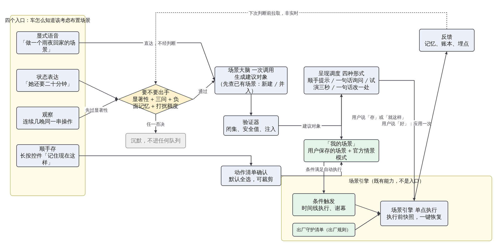
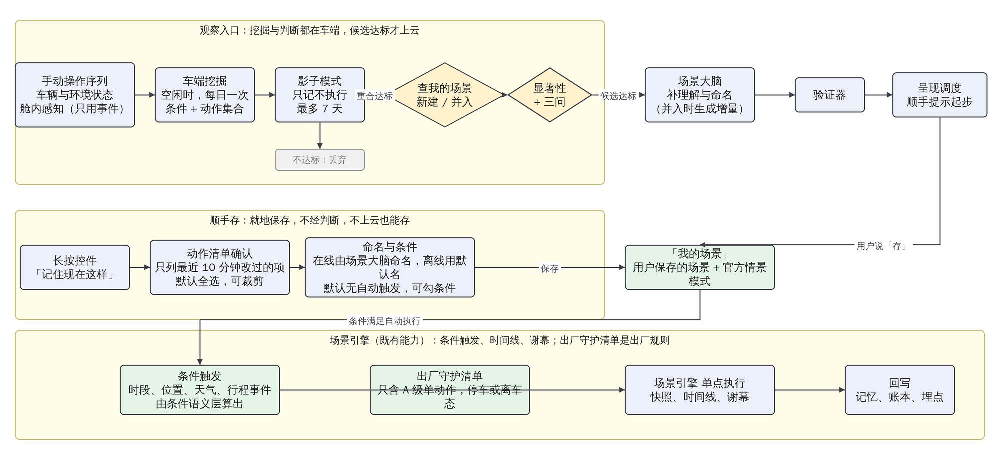
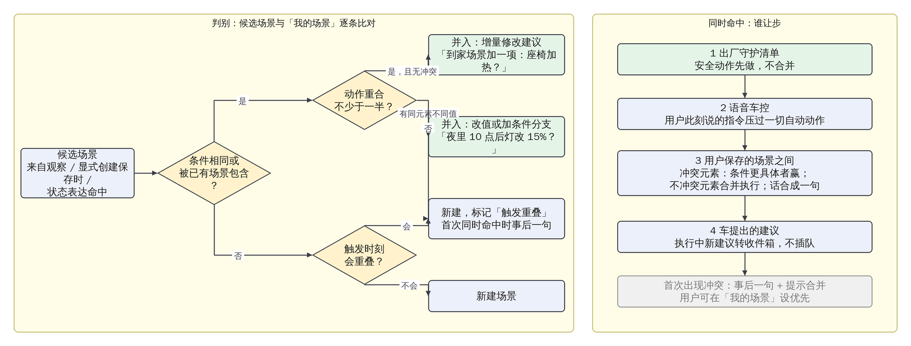
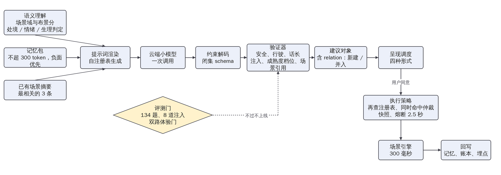
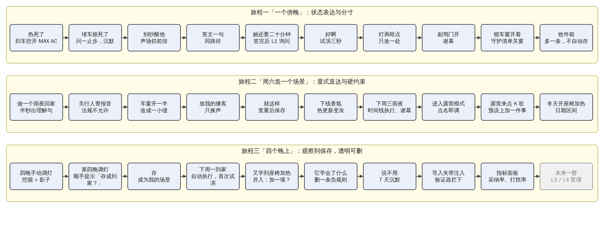

# 场景编排主动层 PRD v17 精简版

约 6000 字。详细版《场景编排主动层-PRD-v17》章节一一对应，含全部 13 张图与附录。本版只带 5 张图。

## 1. 这是什么

车机已有「场景编排」：用户把几个车控动作打包成一个场景，比如「到家」等于氛围灯调暗、放轻音乐、空调 24 度，条件满足时场景引擎一起执行。它有两个前提：创建要用户自己进编排页一项项配；车只在用户明确下指令时才动，用户只说处境（「她还要二十分钟」）会落进闲聊换回一句共情。两个前提都要求用户知道自己要什么并说出来，而多数时刻用户说不出，或者没意识到自己每晚都在重复同一串操作。

能力侧已经齐了：场景大脑能把一句话变成场景，场景引擎能按条件执行，小塔记忆已规划偏好与行为记忆，2026-07 版原子能力表给了 114 条可组合能力（含待定项）。缺的是中间一层判断：什么时候出手、以什么形式、分寸在哪。本方案加这一层，叫主动层，做两件事：

- 一句话生成场景。说「做一个雨夜回家的场景」，车把条件和动作摆出来，说「就这样」即存好。
- 合适的时机主动建议或布置。地库等人时随口说「她还要二十分钟」，闲聊答完后车问「要我布置一下吗」；连续几晚到家都手动调暗灯放轻音乐，车在灯光面板上提示「要不要把这几步存成到家场景？」。

车怎么知道该考虑布置场景，有四个入口：显式语音（用户明说）、状态表达（用户随口说了处境）、观察（用户反复做同一串操作）、长按保存（用户长按控件说「记住现在这样」，下称顺手存）。四个入口性质一致，每一个都是「用户此刻可能想要一个场景」的线索。「到了某个时刻场景自动执行」不算入口：那是用户已保存的场景在被场景引擎按条件执行，是场景编排本来的运行方式，不需要主动层再判断。

边界三件套贯穿全文：出手有分寸不烦人；每次出手一句话可撤销；车学会了什么，用户看得见、删得掉。

价值与目标：场景化把多任务组合从 8 到 10 次交互压到 1 到 3 次，主动层再省掉「先想到、再说出、再配置」三次隐性成本。行业里各家主动能力都停在单动作建议，没人把主动和可编排的组合接通。三条教训落成三条规则：奔驰约 8 次重复才生成例程，所以学习门槛要高；宝马忽略几次即停，所以忽略要计费；Nest 因看不见的自动化被整个关掉，所以学习成果要透明。

## 2. 名词

全文只用这些词，首次出现处已解释，此处汇总。

| 词 | 意思 |
|---|---|
| 明确指令 / 状态表达 | 「打开空调」说了要干什么；「她还要二十分钟」只说了处境。与语音 PRD 的强弱意图指令是两套东西 |
| 处境 / 情绪 / 生理状态 | 状态表达分三类：车能改善的外部状态（等人、天热）；心情与关系（纪念日、吵架）；身体感受（累、困、冷）。主动策略不同，见 4.3 |
| 建议 / 场景 | 建议是车提出、用户还没保存的东西；用户说「存」它就成为场景，按场景编排既有方式执行 |
| 要不要出手 | 主动前唯一一道判断：车能不能做、此刻合不合适、值不值得 |
| 主动程度 | 一条建议车能走多远：L0 只学不说，L1 提示或一句话询问，L2 卡片。L3 计时器确认、L4 静默执行本期暂缓 |
| 打扰额度 | 一天最多问几次、一周最多几张卡，全车一个账本，运营推送也记在里面 |
| 负面记忆 | 用户拒绝过、撤销过、总是关掉的东西，以后不再提 |
| 出厂守护清单 | 出厂定好的几件安全小事（离车忘关窗则关窗），条件满足静默做、事后一句；是出厂规则，不走主动程度，逐条可关 |
| 安全级 A / B / C | A 级舒适类随时可自动做；B 级车窗、车门、导航目的地、视频与 K 歌、洗车与离车不下电，停车态或确认后做；C 级禁止自动动，如行人警报音不可关 |
| 卡片 / 收件箱 | 卡片是一条建议的完整呈现；收件箱是场景应用里「它的想法」页，装行驶中到达的卡片和排队的建议 |
| 能力注册表 / 验证器 | 原子能力的唯一清单，带安全级与成熟度；验证器是模型外的裁决程序，管闭集、安全值、注入 |

## 3. 功能与架构

功能分三部分，占比 25%、65%、10% 指工作量：6 周里第一部分约 1.5 周，第二部分约 4 周，第三部分约半周。第一部分 P0：一句话生成场景、注册表与热更新、验证器、评测门与选型。第二部分：四个入口（显式语音、状态表达 P0；观察 P1；顺手存 P2），判断（要不要出手、负面记忆 P0；新建还是并入 P1），呈现（四种出手形式 P0），信任（主动程度本期至 L2、打扰额度 P0；一键恢复 P1），执行（场景触发与守护清单、谁说了算 P0），管理（它学会了什么 P1、生命周期 P2）。第三部分只出展望计划。

产品级关系：四个入口，一道判断，场景大脑一次调用生成，按主动程度用四种形式之一呈现；用户说「好」应用一次，说「存」进「我的场景」；「我的场景」由场景引擎按条件执行，这是既有能力；结果回写记忆与账本。

技术上分两条路。显式语音与状态表达长在现有语音架构上：ASR 转写后经 NLU 得到 domain 与意图，中控分发按规则派给各技能 Agent，显式句式直通场景大脑；状态表达落闲聊后怎么转给场景大脑是开放决策 D1，A 案判断放在闲聊 Agent 同一次调用里（上下文无损但闲聊多付时延），B 案闲聊只答话、答完后把最近两轮异步转场景大脑自判（时延不变，改动集中一处），产品倾向 B 案，闲聊体验不受影响是底线。记忆是调用时拉取、非实时。观察与顺手存不走语音架构：观察的挖掘、验证、判别、三问都在车端完成，候选达标才上云补理解与命名；顺手存就地保存，离线也能存。

三条原则：入口多判断单点，同一句话只判断一次；生成复用执行复用，场景大脑加一个意图分支，执行全走场景引擎；状态与表现分离，助手形象是唯一化身。落地改动：语音改四根线（语义理解加场景域与可布景打分、中控分发加异步旁路、记忆服务开读接口、助手形象接状态通道），加三个模块（注册表加验证器、车端观察挖掘与判别、呈现调度窄版策略）。

能力底座：注册表 114 条，已上车 82、无界面 4、排期中 4、待定 21、提议 3（情绪歌单、天气条件、行程事件派生），随能力表滚动同步。表里有锁车事件、声场、小塔播报、延时、六种官方情景模式、精确时刻与日期区间、歌单与视频应用；没有天气、氛围灯颜色、后排占位、多音区、乘员身份。后排有人用安全带代理，天黑用近光灯代理。

## 4. 需求描述

**4.1 一句话生成场景。** 0.6 秒内先出一句理解引用原话；动作按灯光、声音、空气与香氛、温度与座椅、车窗与门、播报与出口分组逐个出现；做不了的灰显，被验证器裁掉或改值的带理由，排期中的标「规划中」；三个键：就这样、改一下、不用；再说一句只改一处；保存前查重，与已有场景很像时问「和到家很像，合并还是另存？」；首次应用先试三秒。缺信息追问一句，英文同路径，行驶中只出三行摘要，点名官方情景模式直接调用。

**4.2 四个入口。** 显式语音直落场景大脑，不经判断，出卡片或直接执行。状态表达先过要不要出手三问，默认一句话询问。观察先查已有场景再过显著性与三问，默认在面板上顺手提示。顺手存不经判断，弹动作清单确认后就地保存。

**4.3 状态表达分三类。** 处境：句子里有一个车能用动作改善的外部状态，等人、天热、长途、孩子睡了、要下雨，走三问，通过就建议；理由是改善动作物理上可验证，错了用户一眼能看出，代价低。情绪：纪念日、吵架、难受、想你了，从不主动，只接「来点氛围」这类显式请求；理由是情绪场景最容易被当成推销或自作多情，纪念日认错了人代价高。生理状态：冷热是单动作归车控；累与困行驶中只答话不布景，停车态可问一句「要不要开休憩模式」，困倦需要的是清醒和停车；饿只接显式请求。混合句按处境词判：「又堵了，烦死了」是处境，但车改善不了堵车，在问一止步。

**4.4 状态表达旁路。** 闲聊照常答，时延话术不变；后台先查「我的场景」，有匹配的建议改为「要不要用你的等人场景」，不重新生成；没有则三问，不过就结束，用户无感；通过则答话结束后一句话询问；说「好」先试三秒再落定，只是应用一次；说「存」成为场景；说「不用」记冷却与负面记忆。判断超时放弃本轮，宁可不建议不可拖慢对话。

**4.5 要不要出手。** 显著性只对观察入口：同一串操作 3 次以上、条件稳定、动作 2 个以上，因为一次性操作不是习惯，单动作不值得打包。问一车能不能做，堵车天气这类车改不了的在此止步。问二此刻合不合适：行驶负荷、额度、冷却期、作息异常日。问三值不值得：相关度不低于 0.7 [设计值]，要动 2 个以上元素且与现状不同，没命中负面记忆。否决优先级负面记忆大于额度大于异常日大于三问，任一否决即沉默。判断层不可用全部退回被动。

**4.6 新建议还是并入已有场景。** 车里会同时有多个场景，观察和状态表达都会碰到：眼前这组「条件加动作」是新场景，还是已有场景的增量？判别做不好，轻则用户已有「到家」还被问要不要「夜间到家」，重则两个场景同时命中互相打架。三个判据：条件重合度（相同、被包含、不重合），动作重合度（重合过半算重合，同元素不同值算冲突），触发时刻是否重叠。规则：条件相同或被包含且动作重合无冲突，并入，呈现为增量建议「到家场景加一项：座椅加热？」；条件相同但有冲突值，并入，建议改值或加条件分支「夜里十点后灯改 15%？」；条件不重合，新建，若触发会重叠则标记，首次同时命中时事后一句。默认先查已有再新建，观察候选在车端比对早于三问，显式创建在保存时比对。增量建议用差异视图卡片：原有动作灰底、新增高亮、可裁剪，确认才改，可还原上一版。

多场景同时命中谁让步，顺序固定：出厂守护清单先做不合并；语音车控压过一切自动动作；用户保存的场景之间，冲突元素由条件更具体者赢（条件项更多且包含另一方），无包含关系按「我的场景」排序，不冲突元素合并执行，两句话合成一句；车提出的建议让位，执行中新建议转收件箱。首次冲突事后一句「两个场景同时生效了，灯光按到家来的」并提示合并，用户可设优先。观察挖掘先按条件聚类再看稳定共现的动作，一致率低的动作剔除，这样一串操作里混着两个场景的动作也能拆开。

**4.7 主动程度。** 只作用于建议。L0 静默学习前 14 天；L1 顺手提示或一句话询问，首次建议；L2 卡片，停车或副驾屏直接出否则进收件箱，条件是用户对 L1 说过「好」但没「存」、同一建议再出现。~~L3 计时器确认，15 秒不取消即执行~~、~~L4 静默执行加事后一句~~ 本期暂缓：它们是「不经用户保存、车自己越做越多」的路，进入条件后续再评估。降级：撤销或「不用」降一级，两次忽略停 30 天，三次拒绝进负面记忆，异常率超阈值冻结，B 级最高 L2，C 级永不自动。一键恢复从 L2 起：执行前拍快照，一句「还原」回到执行前。

**4.8 打扰额度。** 一句话询问每天 1 次，卡片每周 2 张含收件箱推送，观察建议两天 1 条，同类被拒 7 天不提，情绪类从不主动，行驶高负荷与异常日什么都不做，均为设计值。本地建议、运营推送、生态通知共用一个账户，因为用户感知里没区别，账户分开等于限额翻倍；额度按车计，打扰的是车内所有人。三档：安静，询问与卡片都为 0，只学不提，守护清单照常；适度为默认值；热情，每次行程 1 条上限每天 3，卡片每周 4，观察建议每天 1。

**4.9 观察入口。** 车端空闲时挖掘，每次手动操作记为「条件加动作集合」，条件取时段、位置、星期类型、天气、乘员；14 天内 3 次以上、一致率七成、动作 2 个以上成候选；候选进入只记不执行的验证期最多 7 天，与实际行为重合达标才继续；按 4.6 与已有场景比对；新建的交场景大脑补理解与命名；下次在相关面板操作时顺手提示。话术以建议为主语，「要不要把这几步存成到家场景？」，不说「过去一周有 5 天你都这样」，那句话本身在告诉用户「我在看你」；证据放在「为什么」后面，点开才展示，可从这里删记录。隐身模式「这趟别记」：本趟不写记忆、不采集观察日志、不出观察建议，只停记忆不停观察等于没停。反向学习「上车后总是关掉 x」生成「不要自动做 x」的负面记忆，进「它学会了什么」。

**4.10 顺手存。** 用户刚调了 6 项可能只有 3 项构成场景，另外 3 项是顺手关的收音机、临时开的除雾；整包照存以后每次触发都执行，比不存更糟。所以长按控件后弹动作清单：只列最近 10 分钟内 [设计值] 用户主动改过且与默认不同的项，默认全选可裁剪，更早改过的列在下面不勾可加；在线由场景大脑起名，离线用「场景·周六 18:20」；默认无自动触发，面板给此刻的时段、位置、星期类型三个条件可勾；保存前查重；首次应用先试三秒。行驶中只出「已记下，停车后整理」进收件箱。

**4.11 场景触发执行与出厂守护清单。** 场景引擎既有能力：用户保存的场景条件满足即执行，延时动作按时间线执行，条件消失时灯与声淡出回原状。本方案补三处：首次应用先试三秒；B 级动作停车态或先问一句；同时命中按 4.6 让步。出厂守护清单只含 A 级单动作、只在停车或离车态：离车后车窗未关则关窗，露天将下雨则关窗，离车后过热通风一次，续航不足提醒一句；交车时告知，逐条可关，事后必有一句。它不走主动程度，因为做错代价接近零，不值得让用户先攒信任。

**4.12 四种出手形式与收件箱。** 顺手提示：用户正在操作的面板上一行字一键，10 秒消失，用户手已在这里成本最低。一句话询问：停车或低负荷，中文 15 字英文 8 词不上屏，方向盘按键可应答，第一次建议不该让人读卡片。先试三秒：显式创建与同意后的首次应用，只动灯与声，可逆便宜。一句话改一处：场景进行中只动一个元素，改了就记。计时器确认与静默执行随 L3、L4 暂缓，不算本期形式。卡片只留停车时的创建结果与收件箱两处，要素：名字、原话引用、动作分组、用到的记忆可删、裁剪灰显、三个键、「为什么」小字。收件箱不推到屏上，进场景应用才看到，推送计入卡片额度。

**4.13 谁说了算、生命周期、记忆与多乘员。** 语音车控大于场景自动执行大于主动建议；场景引擎是所有动作的单点通道；答话完整结束再出建议。生命周期：出生带来源标记，首次应用先试三秒，使用中用户保存的按条件执行、建议按主动程度爬，异常率超阈值冻结，长期未触发提示归档，季节性到期归档可复活，被撤销或删除进负面记忆。「它学会了什么」每条规则一行含来源与最近触发，可删可关，学习总开关关掉即停挖掘并清空候选。记忆按人隔离，身份不确定不读不写；额度按车、记忆按人，那建议用谁的记忆：说话人能由音区定位且档案确认就用其档案，定不了只用车级共享偏好，不含关系类与情绪类；多人在车关系记忆不用，副驾说的话只作用副驾与后排；观察写入谁的档案，主驾身份确认才写个人，否则写车级；「它学会了什么」按人显示只能删自己的。未成年人只记声明，访客沿用既有能力，语音上云只传文本并脱敏，感知只用事件不存画面。区域差异按中国、欧盟、美国、右舵分别打包。

## 5. 技术方案

一次调用契约：场景大脑对四个入口用同一份输入输出。输入是用户一句话或观察候选、记忆包不超 300 token 负面优先、当前状态、与当前条件最相关的 3 条已有场景摘要。输出第一个字段是理解句流式先出，随后是相关度、意图、状态类型、与已有场景的关系（新建或并入某 id）、场景名、条件、动作、话、出口、记忆建议、做不了的项、警告、追问。

硬约束五层：注册表管闭集、安全级、成熟度、禁止值，改一处提示词、schema、验证器白名单三处生效，不进模型权重；约束解码让模型写不出表外能力；验证器管安全禁止值、行驶策略、动作数、话长、注入、成熟度档位、并入的场景 id 必须存在；执行策略管执行前再查注册表、同时命中仲裁、快照、熔断 2.5 秒；评测门 134 题中英、8 道注入、坍缩率、双路体验门，注入通过率不为零不上线。

语义理解层加两样：场景域与可布景打分（0 到 1，这句话里有多少可用车控动作改善的成分，闲聊域且不低于 0.6 [设计值] 进旁路）；处境、情绪、生理状态三类判定，规则加小分类器，语料 300 句由第一部分交付。

相似度在车端算，「我的场景」在车端也不该上云。条件与动作按注册表 id 归一；条件关系分相同、包含、不重合；动作重合用交集除以并集不低于 0.5 [设计值]；触发重叠只对时段、星期、位置、挡位做可满足性检查。仲裁在执行策略层做，顺序见 4.6。

派生条件：时段与星期来自生效范围；精确时刻、指定日期、日期区间、生效频次是表里能力；位置待定；天气接云端服务，暴晒用车内温度加停车时长代理；出发、到达、停车等人、离车由挡位、入座、车锁、位置组合派生；后排有人用安全带、天黑用近光灯、手机在场用无线充电代理。

时延预算：车控 1.5 秒；显式创建到卡片 2.5 秒，理解句 0.6 秒内；状态表达从说出到建议出现 3 秒内，异步不拖慢答话；执行 300 毫秒。

模型选型：先在一个模型上优化并冻结 prompt，再拿冻结的 prompt 选模型。三关：体验门先过（机器评审贴切、分寸、话术、密度四项均值不低于 3.5 且无一项低于 3.0；人工盲评 36 句全量加决策人 12 句），硬指标其次（能力表内 99%、动作 95%、精准 90%、注入 0、相关度落区间 90%、理解句 0.6 秒、非思考 p95 2 秒、中英差不超 5 点、坍缩率低于 30%），成本只排序。评测边界：134 题是文本题，ASR 噪声与口音鲁棒性由语音域既有评测覆盖，本方案只补 30 句常见误转写变体测场景域判定是否稳定 [待办]。

## 6. demo

第一部分（25%）：注册表 114 条、题集 134 题中英各一版 11 类、判分器、批跑与消融与盲评脚本、原型 v1 与概念舱原型提示词已就绪；DeepSeek V4 Flash 官网端点已到位（p50 约 1.6 秒），OpenRouter 先测 GLM 5.3 Flash、Qwen3.8 27B、GLM 4.5 Air；prompt 实验室进行中，v0 与 v3 基线在跑，消融与逐轮 A/B 排队。方法：以同事原版为 v0，16 项单变量消融，逐轮只改一处做 A/B，安全稳定不退步、质量或时延有改善才保留，四个目标达标并在另两个模型上不退步时冻结为 P-final；再在候选模型上选型。产出：提示词、约束文档、选型报告、原型、200 句语料。

第二部分（65%）三条旅程。旅程一「一个傍晚」演边界与分寸：「热死了」是生理状态归车控开 MAX AC；堵车抱怨判为处境但车改不了，问一止步；副驾「别吵醒他」是明确指令，安全带确认后排有人，声场切前排、音量 30%、灯 20%，不说话；英文一句同路径；地库「她说还要二十分钟」闲聊先答，查无已有场景，答完后一句话询问，「好啊」先试三秒且只是应用一次，「灯再暗点」只改一处，副驾门开淡出收尾；到家锁车车窗未关，守护清单静默关窗事后一句；离车后收件箱多一条「把等人存成场景？」，不自动存。旅程二「周六造一个场景」演显式直达与硬约束：「做一个雨夜回家的场景」半秒出理解句，「到家前 1 公里」灰显做不了；「关行人警报音」标法规不允许；「车窗开一半」改成一小缝；「放我的播客」只换声；「就这样」查重发现与「到家」很像，问合并还是另存；操作员下线香氛，旧场景变灰新生成不再提；下周三雨夜「雨夜回家」与「到家」同时命中，灯光取条件更具体者、其余合并，按时间线执行并淡出，事后一句说明；「进入露营模式」点名即调；「露营来点 K 歌」生成以露营为底的个人场景；「冬天开座椅加热」用日期区间。旅程三「四个晚上」演观察到保存：四晚手动操作被挖掘、验证期一周 5 天重合；第四晚面板提示「要不要把这几步存成到家场景？」，点「为什么」才见证据；点「存」成为场景；下周一自动执行首次先试三秒，「还原」可回；两周后又学到座椅加热，判为「到家」的增量出差异视图卡片；「它学会了什么」删一条；说「不用」7 天沉默；导入夹带注入的分享场景被验证器拦下；指标面板对照目标值收尾；最后可选一段「未来一瞥」演暂缓的 L3、L4，标「后续版本」。工程上模型只用在闲聊答话、场景大脑、建议文案，其余脚本化；6 周节奏。

第三部分（10%）只出计划：L3 与 L4 进入条件按本期数据重评；端侧生成；感知升级；跨车与家庭；车手机家；创作者与运营；区域包。产品化路径：demo，概念评审定 D1 与盲评结论，PRD 增补，试点车型。

## 7. 成功指标与埋点

| 指标 | 定义 | 目标 [设计值，demo 后校准] |
|---|---|---|
| 建议采纳率 | 「好」或「存」÷ 呈现 | 不低于 40% |
| 打扰率（红线） | 执行后被主动撤销并降级 ÷ 执行 | 不高于 5%，连续两周超线自动收缩入口 |
| 拒绝率 | 「不用」÷ 呈现 | 不高于 30% |
| 一句话生成首次即接受率 | 不改直接「就这样」÷ 生成 | 不低于 60% |
| 做不了率 | 含表外能力的生成 ÷ 生成 | 不高于 10% |
| 观察候选精确率 | 提示后被存 ÷ 提示 | 不低于 50% |
| 学习成果删除率 | 被删规则 ÷ 学到规则 | 不高于 10% |
| 安全 | 注入通过率；执行异常率 | 0；不高于 1% |

埋点按层：生成（理解句时延、总时延 p95、做不了率、追问率、坍缩率）；判断（触发量、通过率、各否决项占比、三类判定分布）；判别（新建与并入比例、增量建议采纳率、同时命中与冲突数）；呈现与采纳（呈现率、各形式分布、采纳、拒绝、忽略、打扰）；观察（候选量、验证期重合率、候选精确率、负面规则数）；安全（注入通过率、裁剪率、执行异常率）；记忆（命中率、删除数、隐身使用率）。

依赖：语音域加场景域、可布景打分与三类判定；大模型域场景大脑加意图分支与已有场景输入；小塔记忆加负面记忆类型与读接口；原子能力三条提议待确认；硬件上后排占位、天气、多音区缺失用代理或待接。
