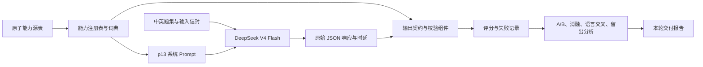
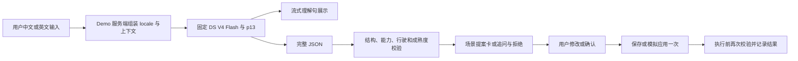

# 第一部分整体结构

第一部分负责把一句话变成可校验的场景提案，为交互 Demo 和后续主动层提供生成底座。产品全貌见 [PRD v17](../../docs/场景编排主动层-PRD-v17.md)。

## 已经完成的实验链路

上述真实调用由 [eval/safe_eval.py](../eval/safe_eval.py) 执行，原始响应、配对关系和配置保存在 [实验目录](../eval/results/prompt-lab-v3/)。p13 冻结后没有根据留出失败继续改 Prompt。

| 部件 | 当前事实来源 |
|---|---|
| 原子能力表 | [notes/inputs](../notes/inputs/) |
| 114 条注册能力及成熟度 | [capabilities.json](contracts/capabilities.json)；原件在 eval |
| 输出契约与值域 | [schema.json](contracts/schema.json)、[vocab.json](contracts/vocab.json) |
| 推荐系统指令 | [system-zh.md](prompt/system-zh.md) |
| 测过的请求配置 | [request.example.json](config/request.example.json)、[冻结清单](../eval/experiments/RELEASE_FREEZE.json) |
| 外部校验实现 | [output_contract.py](../eval/output_contract.py)、[validator.py](../eval/validator.py)；仍需集成到实际产品调用链 |
| 实验设计与原始证据 | [evidence](evidence/README.md) |

## Demo 需要接成的运行链路

这是待完成联调的目标链路。独立 [Scene Studio](https://github.com/hadan8977/scene-studio-demo) 已有前端、服务接口与部分规则；需要把生成部分与本次实验的模型、Prompt、输入和输出契约对齐。它现有 `currentScene` 续改输入与自有 Prompt 不能简单替换后就继承本报告分数；必须明确适配规则并新增续改回归。

流式理解句只用于展示。收到完整 JSON 并通过校验前，不执行任何提议。`offer`、`memory` 是建议，不能当作已经拨号、导航或写入记忆。保存、应用一次和恢复属于应用/执行层的状态，不由模型生成文字决定。

## 三个边界

- **生成与产品体验分开验收。** 实验中的模型总时延不含前端、网络代理、输入处理与持久化全过程。
- **能力快照与热更新分开管理。** 本次交付为冻结快照；`registry.py` 有生成和上下线机制，运行服务仍需完成一致发布、缓存失效、已有提案和执行前复查。
- **实验分数与产品契约不能混用。** PRD v17 的直接车控分流、应用续改与保存流程，不完全等同于本次独立生成题集的输入范围。修改路由或契约后应建立对应的端到端评测。
