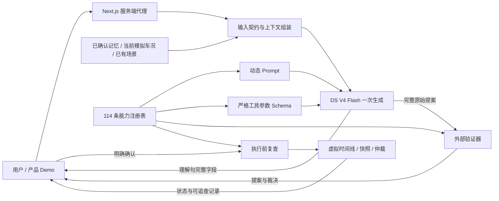

# 第一部分技术运行结构

这是一套可启动的本地技术服务，接在独立的 Scene Studio 产品 Demo 后面。产品展示输入、理解句、场景卡片、应用、保存与撤销；服务负责可信上下文、约束解码、校验、确认和模拟执行。真实车辆接口不在本仓库中。



## 五层约束与实现位置

| 层 | 已实现 | 证据 / 边界 |
|---|---|---|
| 注册表 | 114 条能力、在线状态、成熟度、条件/动作值与禁止值；版本及内容哈希 | `core.Registry`；同一快照渲染 Prompt、Schema、验证名单。关闭后再打开也会改变 revision，拒绝旧提案 |
| Prompt | 由注册表重绘能力段，保留候选的规则与示例；来源及哈希随提案返回 | `compile_prompt`；不能把开发候选称为已验收最终 Prompt |
| 约束解码 | 官网 beta `strict_tool`，唯一工具 `propose_scene`；嵌套禁止额外字段、枚举、数值步长 | `provider.py`；真实 6 次接口探测见 [证据](../studies/round2/architecture/constraint-probe/summary.json)。小样本证明接口可用，不证明所有语义都正确 |
| 外部验证 | 严格 JSON、日期、范围/单位/步长、角色、禁用项、行车限制、负面偏好、动作数、未上线项、条件循环、引用和单项续改 | `core.validate`；非法条件使整张提案不可应用，禁止删掉条件后变成“立即执行” |
| 执行策略 | 提案 5 分钟有效、显式确认、最新车况和版本复查、保存与应用分开、3 秒试演、分段复查、用户优先、一次恢复和日志 | `scheduler.py`；全部为可验证的车辆状态模拟，未发车辆 RPC |

当前保守策略：含未上线动作的场景可按规则保存为概念提案，整张卡片不执行。没有把规划动作删掉后悄悄应用剩余部分。与 PRD 中“灰显概念动作、执行其余已上线动作”的更细策略相比，这是明确未完成的差异。

## 启动

Python 3.12+，安装 `requests`、`jsonschema`。密钥仅放私有环境文件，切勿提交。需要 `DEEPSEEK_API_KEY`（官网）和自行生成的 `PART1_RUNTIME_TOKEN`。不使用腾讯配额。

```powershell
python part1-generation-framework/runtime/server.py --env-file <私有环境文件> --mode strict_tool --template part1-generation-framework/studies/round2/prompts/p26_zh.md
```

`p26` 是第二轮冻结的候选，哈希 `34c9859119cb…`，见 [冻结记录](../studies/round2/final-candidate-freeze.json)。启动参数显式选择它，**不代表最终验收**：它在自动指标、安全和十一个任务类别上都优于两个基线，但四个体验维度的逐维门没有通过，见 [08 报告](../delivery/08-Prompt优化报告-第二轮定稿.md)。p24 仍保留，可用同一参数切换。默认模板仍保留第一轮 p13 快照；评审时必须检查返回的 Prompt 哈希。服务仅监听 `127.0.0.1:8787`，所有接口都要求 Bearer token。

在 Scene Studio 服务端设置：

```text
PART1_RUNTIME_URL=http://127.0.0.1:8787
PART1_RUNTIME_TOKEN=<与技术服务相同的私有值>
```

启动 Scene Studio。`/api/models` 显示 `Part 1 Runtime` 才表示已接入；未配置时旧的独立生成路径仍在，不能混称新结构。浏览器只调用同源 Next.js 代理，拿不到服务 token。Vercel 上的应用不能访问演示电脑的 localhost；当前接入适用于同机、本地、单人演示，公共部署需要独立服务地址和用户隔离。

## 演示顺序

1. 输入“主驾座椅加热一挡”：看到先出理解句、后出完整提案；确认后才改变模拟值。
2. 输入“准备休息，灯暗些、座椅暖些”：合法的光声动作先试演，其余动作 3 秒后进入，撤销恢复快照。
3. 保存后再次生成相同条件的场景：上下文最多带 3 条已有摘要；同触发条件可以并入，保存前仍需确认。
4. 在技术接口关闭一个能力：新 Prompt 和 Schema 同时改变；已生成旧提案不能用旧版本确认，延时未完成段停止。
5. 输入不支持的精确条件或关闭行人警报音：保留原提案与裁决；不把拒绝伪装成成功。
6. 修改灯光：编辑范围仅包含点名设备，其他动作/条件保留。明确记忆通过单独确认接口写入，不从情绪自动写记忆。

## 接口和测试

| 接口 | 用途 |
|---|---|
| GET `/health`、`/registry`、`/schema`、`/state` | 状态、注册表、约束和执行审计 |
| POST `/generate` | SSE：request → understanding → result/error |
| POST `/confirm`、`/restore`、`/execution/cancel` | 保存/应用/拒绝，恢复，取消未完成段 |
| POST `/registry/toggle` | 带 revision 的能力热更新 |
| POST `/simulation/state`、`/simulation/advance`、`/simulation/trigger` | 显式推进模拟车况与时间，不自动驱动车辆 |
| POST `/memory/confirm`、`/memory/delete` | 独立确认的记忆建议与删除 |
| POST `/demo/context`、`/demo/prepare` | 已认证 Demo 的浏览器模拟快照和编辑后再校验 |

```powershell
python -m unittest discover -s part1-generation-framework/runtime -p test_*.py
node --experimental-strip-types part1-generation-framework/runtime/sdk/test_demo_bridge.mjs <python路径> <SceneStudio仓库路径>
```

后者启动真实 Python HTTP 服务并导入实际产品 TypeScript 客户端，用固定数据验证完整传输和确认链路，不消耗模型调用，也不计入模型质量分数。

截至2026-09-08，Python离线30项通过。另有[真实模型HTTP/SSE冒烟](../studies/round2/architecture/live-smoke-p24/summary.json)：6场景通过、5次模型调用，包含拒绝、注入前拦截、确认与恢复；小样本不能代替完整质量测试。产品接入提交为`0ad75616f80610d82987a46ef37867edc74e6996`；最新完成程度和接手命令见[HANDOFF](../studies/round2/HANDOFF.md)。

## PRD 差异，不能写成已完成

- 2.5 秒卡片、0.6 秒理解句是目标，尚未稳定达到；官网严格工具的 3 次探测总时延为约 2.22–2.80 秒。
- 当前一次调用、错误直接返回；未实现 PRD 所列格式失败后的自动再试一次。避免将重试收益混入原始模型 A/B。
- 记忆包使用 UTF-8 字节数不超过 300 的保守上界，未接模型官方 tokenizer；长记录整条省略，日志保留省略 ID。
- 输入注入检测为确定性规则与模型规则组合，不能保证检测所有语义攻击。Schema 也不保证输入理解正确。
- 已有场景采用条件匹配加词项检索，不是训练过的相似度模型；条件引擎支持显式比较和上升沿，完整日历、跨日额度、观察挖掘、D1 双案、300 句训练集属于尚未完整实现的工作。
- 调度器 2.5 秒熔断约束的是本地模拟调度；真实 ECU 超时、读回和补偿尚无执行适配器。
- 多用户认证隔离、真实小塔记忆、真实语音域分发和真实车辆接入没有完成。单人 Demo 的 token 不能替代生产账户隔离。
